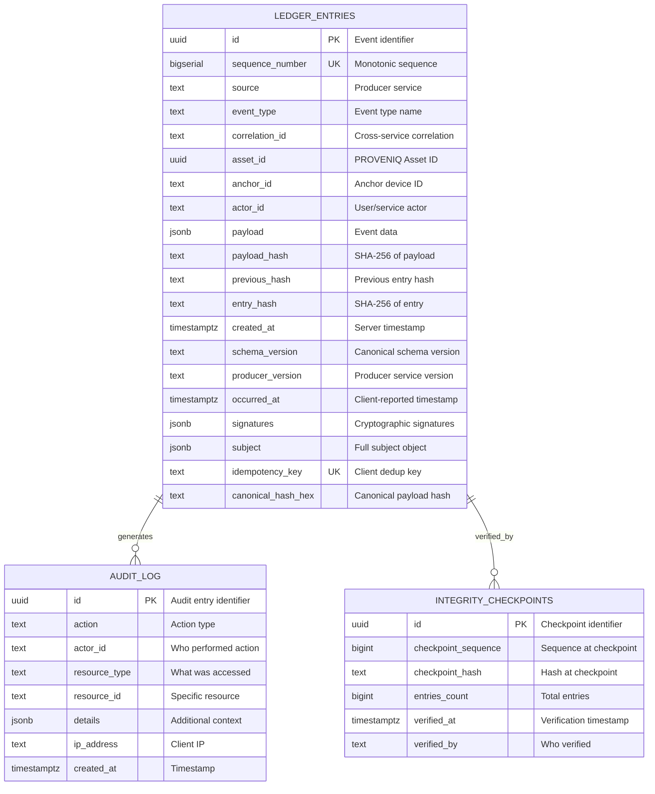

# PROVENIQ Memory (Ledger) - Data Dictionary

**Last Verified Against Commit:** `4146303`  
**Schema Version:** 1.0.0

---

## Executive Summary

This document provides a comprehensive data dictionary for PROVENIQ Memory (Ledger), including entity-relationship diagrams, table schemas, column definitions, and data types. All schemas are verified against the production codebase.

**Target Audience:** Database administrators, backend engineers, data analysts, auditors

---

## Entity-Relationship Diagram



**Status:** [SHIPPED]

---

## Table: ledger_entries

### Purpose

Main event log storing immutable cryptographic records of physical asset events.

**Source:** `backend/src/db.ts`

**Status:** [SHIPPED]

---

### Schema Definition

```sql
CREATE TABLE ledger_entries (
  id UUID PRIMARY KEY,
  sequence_number BIGSERIAL UNIQUE,
  source TEXT NOT NULL,
  event_type TEXT NOT NULL,
  correlation_id TEXT,
  asset_id UUID,
  anchor_id TEXT,
  actor_id TEXT,
  payload JSONB NOT NULL,
  payload_hash TEXT NOT NULL,
  previous_hash TEXT,
  entry_hash TEXT NOT NULL,
  created_at TIMESTAMPTZ NOT NULL DEFAULT now(),
  schema_version TEXT DEFAULT '1.0.0',
  producer_version TEXT,
  occurred_at TIMESTAMPTZ,
  signatures JSONB,
  subject JSONB,
  idempotency_key TEXT,
  canonical_hash_hex TEXT
);
```

---

### Column Definitions

#### id

**Type:** `UUID`  
**Constraints:** PRIMARY KEY  
**Nullable:** No  
**Default:** None (client-provided)

**Purpose:** Unique event identifier

**Format:** UUID v4 (e.g., `123e4567-e89b-12d3-a456-426614174000`)

**Source:** Client-generated via producer service

**Uniqueness:** Enforced by PRIMARY KEY constraint

**Status:** [SHIPPED]

---

#### sequence_number

**Type:** `BIGSERIAL`  
**Constraints:** UNIQUE, NOT NULL  
**Nullable:** No  
**Default:** Auto-increment

**Purpose:** Monotonically increasing sequence for ordering events

**Range:** 0 to 9,223,372,036,854,775,807 (2^63 - 1)

**Genesis Value:** 0 (first entry)

**Uniqueness:** Enforced by UNIQUE constraint `ledger_entries_sequence_unique`

**Immutability:** Cannot be modified (WORM trigger)

**Status:** [SHIPPED]

---

#### source

**Type:** `TEXT`  
**Constraints:** NOT NULL  
**Nullable:** No  
**Default:** None

**Purpose:** Identifies the producer service that created the event

**Valid Values:** See [Producer Enum](#producer-enum)

**Examples:**
- `anchors-ingest`
- `service`
- `transit`
- `protect`

**Indexed:** Yes (`idx_ledger_source`)

**Status:** [SHIPPED]

---

#### event_type

**Type:** `TEXT`  
**Constraints:** NOT NULL  
**Nullable:** No  
**Default:** None

**Purpose:** Canonical event type name

**Format:** `DOMAIN_NOUN_VERB_PAST` (uppercase, underscore-separated)

**Examples:**
- `ANCHOR_SEAL_BROKEN`
- `SERVICE_RECORD_CREATED`
- `TRANSIT_SHIPMENT_DELIVERED`

**Validation:** Must match registered event type in `backend/src/ledger.events.ts`

**Indexed:** Yes (`idx_ledger_event_type`)

**Status:** [SHIPPED]

---

#### correlation_id

**Type:** `TEXT`  
**Constraints:** None  
**Nullable:** Yes  
**Default:** NULL

**Purpose:** Links related events across services

**Format:** UUID v4 or service-specific identifier

**Use Case:** Trace multi-step workflows (e.g., shipment → delivery → claim)

**Indexed:** Yes (`idx_ledger_correlation_id`)

**Status:** [SHIPPED]

---

#### asset_id

**Type:** `UUID`  
**Constraints:** None  
**Nullable:** Yes  
**Default:** NULL

**Purpose:** PROVENIQ Asset ID (PAID) - primary subject of event

**Format:** UUID v4

**Relationship:** References asset in Core service (not enforced by FK)

**Indexed:** Yes (`idx_ledger_asset_id`)

**Status:** [SHIPPED]

---

#### anchor_id

**Type:** `TEXT`  
**Constraints:** None  
**Nullable:** Yes  
**Default:** NULL

**Purpose:** Physical anchor device identifier

**Format:** String (max 64 characters)

**Examples:**
- `ANCHOR-12345`
- `TAG-ABC123`

**Indexed:** Yes (`idx_ledger_anchor_id`)

**Status:** [SHIPPED]

---

#### actor_id

**Type:** `TEXT`  
**Constraints:** None  
**Nullable:** Yes  
**Default:** NULL

**Purpose:** User or service that initiated the event

**Format:** Firebase UID, service name, or system identifier

**Examples:**
- `firebase-uid-abc123`
- `system`
- `service-worker-01`

**Status:** [SHIPPED]

---

#### payload

**Type:** `JSONB`  
**Constraints:** NOT NULL  
**Nullable:** No  
**Default:** None

**Purpose:** Event-specific data (domain-dependent)

**Format:** JSON object (binary storage)

**Validation:** Schema depends on `event_type`

**Example:**
```json
{
  "work_order_id": "uuid-v4",
  "parts_replaced": ["brake_pads", "rotors"],
  "labor_hours": 2.5,
  "cost_cents": 35000
}
```

**Immutability:** Cannot be modified (WORM trigger)

**Status:** [SHIPPED]

---

#### payload_hash

**Type:** `TEXT`  
**Constraints:** NOT NULL  
**Nullable:** No  
**Default:** None

**Purpose:** SHA-256 hash of payload for integrity verification

**Format:** 64-character hexadecimal string

**Calculation:** `SHA256(JSON.stringify(payload, Object.keys(payload).sort()))`

**Example:** `a1b2c3d4e5f6789012345678901234567890123456789012345678901234567890`

**Verification:** Recompute hash and compare to detect tampering

**Status:** [SHIPPED]

---

#### previous_hash

**Type:** `TEXT`  
**Constraints:** None  
**Nullable:** Yes (NULL for Genesis block)  
**Default:** NULL

**Purpose:** Hash of previous entry for chain linkage

**Format:** 64-character hexadecimal string (SHA-256)

**Genesis Value:** NULL (first entry has no predecessor)

**Chain Rule:** `previous_hash[n] = entry_hash[n-1]`

**Verification:** Ensures chain continuity

**Status:** [SHIPPED]

---

#### entry_hash

**Type:** `TEXT`  
**Constraints:** NOT NULL  
**Nullable:** No  
**Default:** None

**Purpose:** SHA-256 hash of entry metadata for tamper detection

**Format:** 64-character hexadecimal string

**Calculation:** `SHA256(payload_hash | previous_hash | source | event_type | timestamp)`

**Immutability:** Cannot be modified (WORM trigger)

**Status:** [SHIPPED]

---

#### created_at

**Type:** `TIMESTAMPTZ`  
**Constraints:** NOT NULL, DEFAULT now()  
**Nullable:** No  
**Default:** Server timestamp at insertion

**Purpose:** Server-side timestamp of event ingestion

**Format:** ISO 8601 with timezone (e.g., `2024-12-29T12:00:00Z`)

**Precision:** Microseconds

**Timezone:** UTC

**Indexed:** Yes (`idx_ledger_created_at`)

**Status:** [SHIPPED]

---

#### schema_version

**Type:** `TEXT`  
**Constraints:** DEFAULT '1.0.0'  
**Nullable:** Yes  
**Default:** `1.0.0`

**Purpose:** Canonical event envelope schema version

**Format:** Semantic versioning (e.g., `1.0.0`)

**Current Version:** `1.0.0` [LOCKED]

**Status:** [SHIPPED]

---

#### producer_version

**Type:** `TEXT`  
**Constraints:** None  
**Nullable:** Yes  
**Default:** NULL

**Purpose:** Version of producer service that created event

**Format:** Semantic versioning (e.g., `1.2.3`)

**Example:** `1.0.0`

**Status:** [SHIPPED]

---

#### occurred_at

**Type:** `TIMESTAMPTZ`  
**Constraints:** None  
**Nullable:** Yes  
**Default:** NULL

**Purpose:** Client-reported timestamp of when event occurred

**Format:** ISO 8601 with timezone

**Difference from created_at:** `occurred_at` is client time, `created_at` is server time

**Status:** [SHIPPED]

---

#### signatures

**Type:** `JSONB`  
**Constraints:** None  
**Nullable:** Yes  
**Default:** NULL

**Purpose:** Cryptographic signatures from devices or providers

**Format:** JSON object with optional signature fields

**Schema:**
```json
{
  "device_sig": "ed25519-hex-signature",
  "provider_sig": "ed25519-hex-signature"
}
```

**Status:** [SHIPPED]

---

#### subject

**Type:** `JSONB`  
**Constraints:** None  
**Nullable:** Yes  
**Default:** NULL

**Purpose:** Full subject object with all related IDs

**Schema:**
```json
{
  "asset_id": "uuid-v4",
  "anchor_id": "string",
  "shipment_id": "uuid-v4",
  "policy_id": "uuid-v4",
  "claim_id": "uuid-v4",
  "auction_id": "uuid-v4",
  "work_order_id": "uuid-v4",
  "inspection_id": "uuid-v4",
  "lease_id": "uuid-v4",
  "loan_id": "uuid-v4",
  "seal_id": "string"
}
```

**Status:** [SHIPPED]

---

#### idempotency_key

**Type:** `TEXT`  
**Constraints:** UNIQUE (partial index WHERE NOT NULL)  
**Nullable:** Yes  
**Default:** NULL

**Purpose:** Client-provided key for duplicate detection

**Format:** String (1-256 characters)

**Uniqueness:** Enforced by partial unique index `idx_ledger_idempotency_key`

**Behavior:**
- First submission: 201 Created
- Duplicate submission: 200 OK (idempotent=true)

**Status:** [SHIPPED]

---

#### canonical_hash_hex

**Type:** `TEXT`  
**Constraints:** None  
**Nullable:** Yes  
**Default:** NULL

**Purpose:** Canonical payload hash from client (for verification)

**Format:** 64-character hexadecimal string (SHA-256)

**Difference from payload_hash:** Client-calculated vs server-calculated

**Status:** [SHIPPED]

---

### Indices

| Index Name | Columns | Type | Purpose |
|------------|---------|------|---------|
| `ledger_entries_pkey` | `id` | PRIMARY KEY | Unique event lookup |
| `ledger_entries_sequence_unique` | `sequence_number` | UNIQUE | Sequence uniqueness |
| `idx_ledger_source` | `source` | B-tree | Filter by producer |
| `idx_ledger_event_type` | `event_type` | B-tree | Filter by event type |
| `idx_ledger_asset_id` | `asset_id` | B-tree | Filter by asset |
| `idx_ledger_anchor_id` | `anchor_id` | B-tree | Filter by anchor |
| `idx_ledger_correlation_id` | `correlation_id` | B-tree | Filter by correlation |
| `idx_ledger_created_at` | `created_at` | B-tree | Time-range queries |
| `idx_ledger_idempotency_key` | `idempotency_key` | UNIQUE (partial) | Duplicate prevention |

**Status:** [SHIPPED]

---

### Constraints

| Constraint Name | Type | Columns | Enforcement |
|-----------------|------|---------|-------------|
| `ledger_entries_pkey` | PRIMARY KEY | `id` | Machine-Enforced |
| `ledger_entries_sequence_unique` | UNIQUE | `sequence_number` | Machine-Enforced |
| Partial unique index | UNIQUE | `idempotency_key` WHERE NOT NULL | Machine-Enforced |

**Status:** [SHIPPED]

---

### Triggers

| Trigger Name | Event | Function | Purpose |
|--------------|-------|----------|---------|
| `enforce_ledger_immutability` | BEFORE UPDATE | `prevent_ledger_mutation()` | Block updates |
| `enforce_ledger_immutability` | BEFORE DELETE | `prevent_ledger_mutation()` | Block deletes |

**Status:** [SHIPPED]

**Enforcement:** Machine-Enforced (Hard)

---

## Table: audit_log

### Purpose

Immutable audit trail of all access and verification attempts.

**Source:** `backend/src/db.ts`

**Status:** [SHIPPED]

---

### Schema Definition

```sql
CREATE TABLE audit_log (
  id UUID PRIMARY KEY,
  action TEXT NOT NULL,
  actor_id TEXT,
  resource_type TEXT NOT NULL,
  resource_id TEXT,
  details JSONB,
  ip_address TEXT,
  created_at TIMESTAMPTZ NOT NULL DEFAULT now()
);
```

---

### Column Definitions

#### id

**Type:** `UUID`  
**Constraints:** PRIMARY KEY  
**Nullable:** No

**Purpose:** Unique audit entry identifier

**Format:** UUID v4

**Status:** [SHIPPED]

---

#### action

**Type:** `TEXT`  
**Constraints:** NOT NULL  
**Nullable:** No

**Purpose:** Type of action performed

**Valid Values:**
- `canonical_event_ingested`
- `event_ingested`
- `event_read`
- `integrity_verified`

**Indexed:** Yes (`idx_audit_action`)

**Status:** [SHIPPED]

---

#### actor_id

**Type:** `TEXT`  
**Constraints:** None  
**Nullable:** Yes

**Purpose:** User or service that performed action

**Format:** Firebase UID, service name, or system identifier

**Indexed:** Yes (`idx_audit_actor`)

**Status:** [SHIPPED]

---

#### resource_type

**Type:** `TEXT`  
**Constraints:** NOT NULL  
**Nullable:** No

**Purpose:** Type of resource accessed

**Valid Values:**
- `ledger_entry`
- `integrity_check`

**Status:** [SHIPPED]

---

#### resource_id

**Type:** `TEXT`  
**Constraints:** None  
**Nullable:** Yes

**Purpose:** Specific resource identifier (e.g., event UUID)

**Format:** UUID or identifier string

**Status:** [SHIPPED]

---

#### details

**Type:** `JSONB`  
**Constraints:** None  
**Nullable:** Yes

**Purpose:** Additional context about the action

**Format:** JSON object (domain-dependent)

**Example:**
```json
{
  "event_type": "SERVICE_RECORD_CREATED",
  "sequence_number": 12345,
  "idempotent": false
}
```

**Status:** [SHIPPED]

---

#### ip_address

**Type:** `TEXT`  
**Constraints:** None  
**Nullable:** Yes

**Purpose:** Client IP address

**Format:** IPv4 or IPv6 string

**Status:** [SHIPPED]

---

#### created_at

**Type:** `TIMESTAMPTZ`  
**Constraints:** NOT NULL, DEFAULT now()  
**Nullable:** No

**Purpose:** Timestamp of audit entry

**Format:** ISO 8601 with timezone

**Indexed:** Yes (`idx_audit_created_at`)

**Status:** [SHIPPED]

---

### Indices

| Index Name | Columns | Type | Purpose |
|------------|---------|------|---------|
| `audit_log_pkey` | `id` | PRIMARY KEY | Unique audit lookup |
| `idx_audit_action` | `action` | B-tree | Filter by action type |
| `idx_audit_actor` | `actor_id` | B-tree | Filter by actor |
| `idx_audit_created_at` | `created_at` | B-tree | Time-range queries |

**Status:** [SHIPPED]

---

### Triggers

| Trigger Name | Event | Function | Purpose |
|--------------|-------|----------|---------|
| `enforce_audit_immutability` | BEFORE UPDATE | `prevent_audit_mutation()` | Block updates |
| `enforce_audit_immutability` | BEFORE DELETE | `prevent_audit_mutation()` | Block deletes |

**Status:** [SHIPPED]

**Enforcement:** Machine-Enforced (Hard)

---

## Table: integrity_checkpoints

### Purpose

Periodic snapshots of ledger state for faster integrity verification.

**Source:** `backend/src/db.ts`

**Status:** [SHIPPED]

---

### Schema Definition

```sql
CREATE TABLE integrity_checkpoints (
  id UUID PRIMARY KEY,
  checkpoint_sequence BIGINT NOT NULL,
  checkpoint_hash TEXT NOT NULL,
  entries_count BIGINT NOT NULL,
  verified_at TIMESTAMPTZ NOT NULL DEFAULT now(),
  verified_by TEXT
);
```

---

### Column Definitions

#### id

**Type:** `UUID`  
**Constraints:** PRIMARY KEY  
**Nullable:** No

**Purpose:** Unique checkpoint identifier

**Format:** UUID v4

**Status:** [SHIPPED]

---

#### checkpoint_sequence

**Type:** `BIGINT`  
**Constraints:** NOT NULL  
**Nullable:** No

**Purpose:** Sequence number at time of checkpoint

**Format:** Integer (0 to 2^63 - 1)

**Status:** [SHIPPED]

---

#### checkpoint_hash

**Type:** `TEXT`  
**Constraints:** NOT NULL  
**Nullable:** No

**Purpose:** Entry hash at checkpoint sequence

**Format:** 64-character hexadecimal string (SHA-256)

**Status:** [SHIPPED]

---

#### entries_count

**Type:** `BIGINT`  
**Constraints:** NOT NULL  
**Nullable:** No

**Purpose:** Total number of entries at checkpoint

**Format:** Integer

**Status:** [SHIPPED]

---

#### verified_at

**Type:** `TIMESTAMPTZ`  
**Constraints:** NOT NULL, DEFAULT now()  
**Nullable:** No

**Purpose:** Timestamp of checkpoint creation

**Format:** ISO 8601 with timezone

**Status:** [SHIPPED]

---

#### verified_by

**Type:** `TEXT`  
**Constraints:** None  
**Nullable:** Yes

**Purpose:** Who created the checkpoint

**Format:** User ID or system identifier

**Status:** [SHIPPED]

---

## Enumerations

### Producer Enum

**Source:** `backend/src/ledger.events.ts`

**Valid Values:**
```typescript
[
  'anchors-ingest',
  'service',
  'transit',
  'protect',
  'claimsiq',
  'capital',
  'bids',
  'ops',
  'properties',
  'home',
  'origins',
  'core',
]
```

**Status:** [SHIPPED]

**Enforcement:** Application-level (Zod validation)

---

### CustodyState Enum

**Source:** `backend/src/ledger.events.ts`

**Valid Values:**
```typescript
[
  'CREATED',
  'OFFERED',
  'IN_TRANSIT',
  'DELIVERED',
  'DISPUTED',
  'CLOSED'
]
```

**Status:** [SHIPPED]

**Enforcement:** Application-level (Zod validation)

---

## Data Types Reference

| PostgreSQL Type | Size | Range | Use Case |
|-----------------|------|-------|----------|
| `UUID` | 16 bytes | N/A | Unique identifiers |
| `BIGSERIAL` | 8 bytes | 0 to 2^63 - 1 | Auto-incrementing sequence |
| `TEXT` | Variable | Unlimited | String data |
| `JSONB` | Variable | Unlimited | JSON documents (binary) |
| `TIMESTAMPTZ` | 8 bytes | 4713 BC to 294276 AD | Timestamps with timezone |
| `BIGINT` | 8 bytes | -2^63 to 2^63 - 1 | Large integers |

**Status:** [SHIPPED]

---

## Data Retention

**Policy:** Infinite retention (immutable by design)

**Implications:**
- Events cannot be deleted
- Database grows indefinitely
- No automatic archival

**Mitigation:** Do NOT store PII in event payloads

**Status:** [POLICY-ENFORCED]

---

## Data Migration

**Strategy:** Forward-only migrations (no rollbacks)

**Prohibited Operations:**
- `DROP COLUMN` on `ledger_entries`
- `ALTER COLUMN TYPE` on `ledger_entries`
- Data mutation on `ledger_entries`

**Allowed Operations:**
- `ADD COLUMN` (with default value)
- `CREATE INDEX`
- `CREATE TRIGGER`

**Status:** [POLICY-ENFORCED]

---

**Last Verified Against Commit:** `4146303`  
**Schema Version:** 1.0.0
