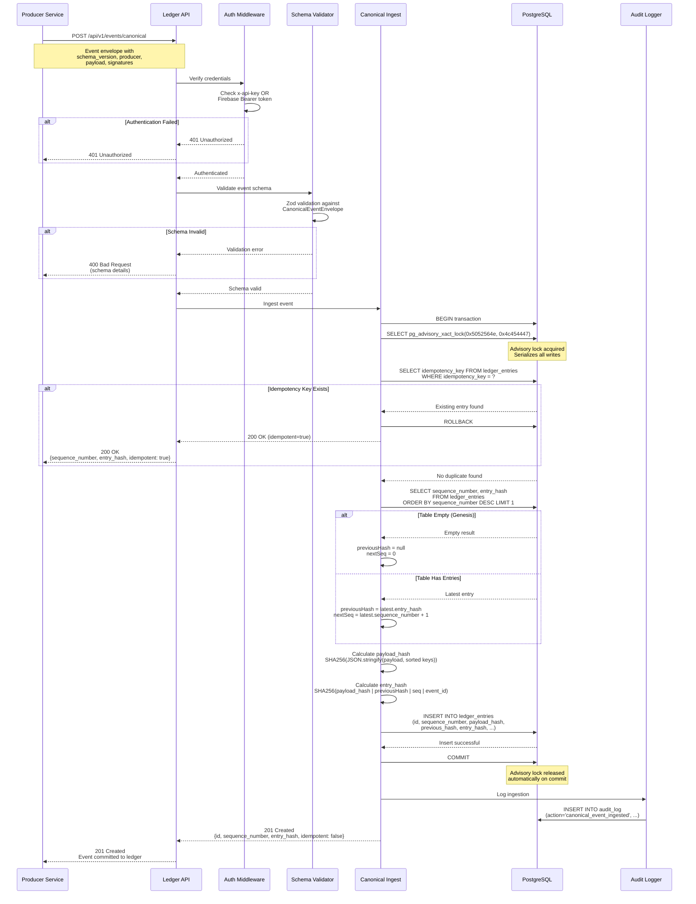
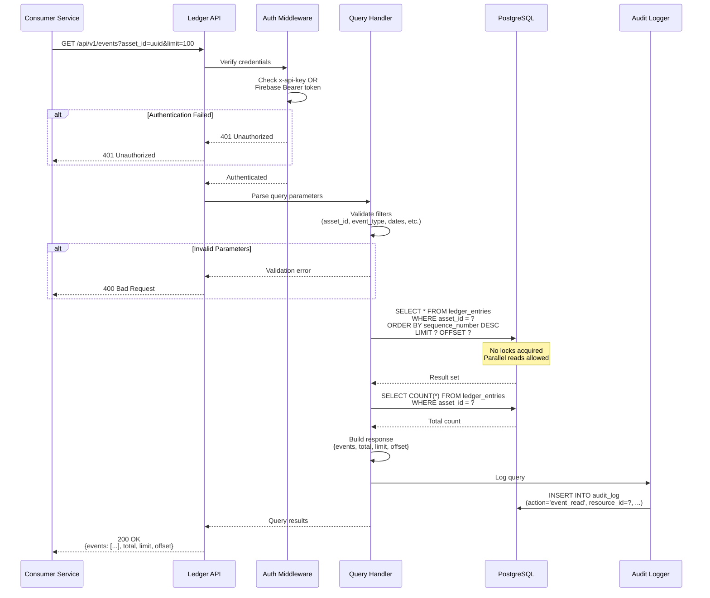
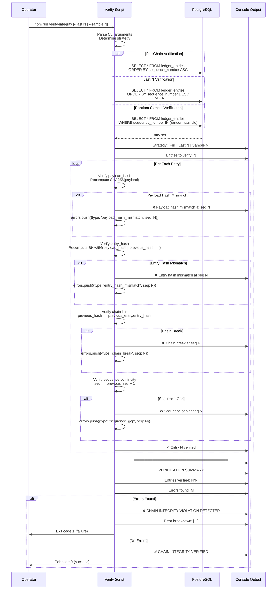
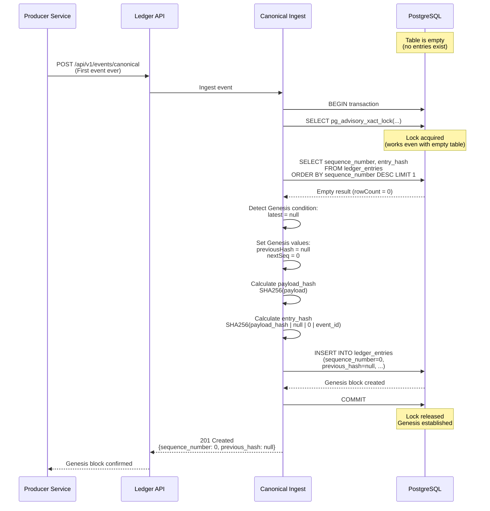
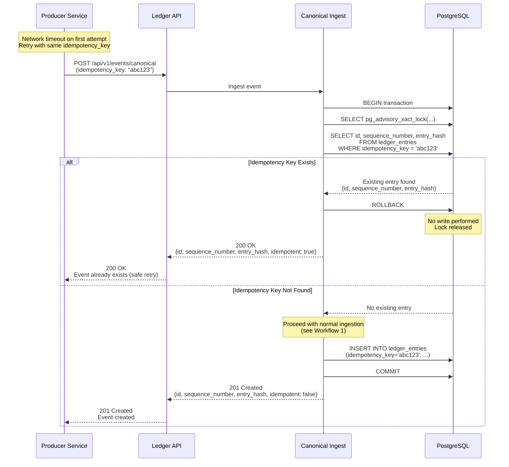
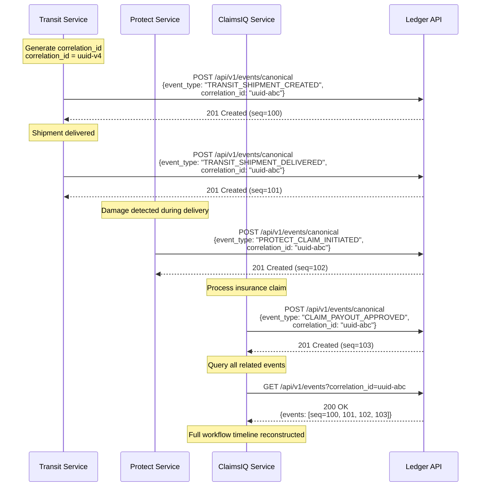
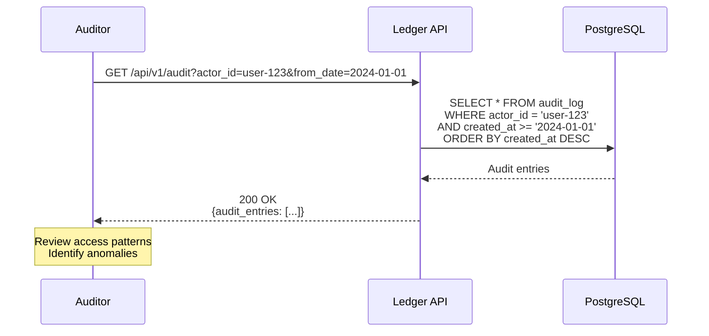

# PROVENIQ Memory (Ledger) - Workflows

**Last Verified Against Commit:** `4146303`  
**Schema Version:** 1.0.0

---

## Executive Summary

This document provides detailed sequence diagrams and workflow descriptions for all major operations in PROVENIQ Memory (Ledger). Each workflow is verified against the production codebase with explicit status tags.

**Target Audience:** Backend engineers, integration developers, technical architects

---

## Workflow 1: Canonical Event Ingestion

### Overview

**Purpose:** Write a new event to the ledger with cryptographic integrity

**Concurrency:** Serialized (advisory lock)

**Idempotency:** Supported via `idempotency_key`

**Status:** [SHIPPED]

---

### Sequence Diagram



**Status:** [SHIPPED]

---

### Critical Path Steps

1. **Authentication** - Verify Firebase token OR Admin API Key
2. **Schema Validation** - Zod validates against `CanonicalEventEnvelope`
3. **Advisory Lock** - Acquire `pg_advisory_xact_lock` (serializes writes)
4. **Idempotency Check** - Query for existing `idempotency_key`
5. **Latest Entry Retrieval** - Get previous hash and sequence
6. **Hash Calculation** - Compute `payload_hash` and `entry_hash`
7. **Database Insert** - Write new entry with incremented sequence
8. **Transaction Commit** - Release advisory lock
9. **Audit Logging** - Record ingestion event

**Status:** [SHIPPED]

---

### Error Scenarios

| Error | HTTP Status | Cause | Resolution |
|-------|-------------|-------|------------|
| Authentication Failed | 401 | Invalid credentials | Check API key or Firebase token |
| Schema Validation Failed | 400 | Invalid event envelope | Fix event structure |
| Invalid Event Type | 400 | Unregistered event type | Use valid event type |
| Database Connection Failed | 500 | Database unavailable | Retry with backoff |
| Constraint Violation | 500 | Sequence conflict (rare) | Retry (advisory lock prevents this) |

**Status:** [SHIPPED]

---

## Workflow 2: Event Query

### Overview

**Purpose:** Retrieve events with filtering and pagination

**Concurrency:** Parallel (no locks)

**Performance:** ~10-50ms p50 [UNKNOWN]

**Status:** [SHIPPED]

---

### Sequence Diagram



**Status:** [SHIPPED]

---

### Query Parameters

| Parameter | Type | Purpose | Example |
|-----------|------|---------|---------|
| `source` | String | Filter by producer | `service` |
| `event_type` | String | Filter by event type | `SERVICE_RECORD_CREATED` |
| `asset_id` | UUID | Filter by asset | `uuid-v4` |
| `anchor_id` | String | Filter by anchor | `ANCHOR-12345` |
| `correlation_id` | String | Filter by correlation | `uuid-v4` |
| `from_date` | ISO 8601 | Events after date | `2024-01-01T00:00:00Z` |
| `to_date` | ISO 8601 | Events before date | `2024-12-31T23:59:59Z` |
| `limit` | Integer | Max results (default 100, max 1000) | `100` |
| `offset` | Integer | Pagination offset (default 0) | `0` |

**Status:** [SHIPPED]

---

### Performance Optimization

**Indexed Queries:**
- `asset_id` - Uses `idx_ledger_asset_id`
- `event_type` - Uses `idx_ledger_event_type`
- `source` - Uses `idx_ledger_source`
- `created_at` - Uses `idx_ledger_created_at`

**Unindexed Queries:**
- Payload field filtering (requires full table scan)

**Recommendation:** Always use indexed filters when possible

**Status:** [SHIPPED]

---

## Workflow 3: Integrity Verification

### Overview

**Purpose:** Verify hash chain integrity from Genesis to Head

**Execution:** Manual (via npm script) or API endpoint

**Strategies:** Full chain, last N, random sample

**Status:** [SHIPPED]

---

### Sequence Diagram



**Status:** [SHIPPED]

---

### Verification Checks

| Check | Purpose | Detection |
|-------|---------|-----------|
| **Payload Hash** | Verify payload integrity | Detects payload tampering |
| **Entry Hash** | Verify metadata integrity | Detects metadata tampering |
| **Chain Link** | Verify hash linkage | Detects chain breaks |
| **Sequence Continuity** | Verify no gaps | Detects missing entries |

**Status:** [SHIPPED]

---

### Verification Strategies

**1. Full Chain (Default):**
```bash
npm run verify-integrity
```
- Verifies all entries from Genesis to Head
- Use for small ledgers (< 1000 entries)
- Duration: ~5-10 seconds per 1000 entries [UNKNOWN]

**2. Last N Entries:**
```bash
npm run verify-integrity -- --last 1000
```
- Verifies most recent N entries
- Use for large ledgers (>= 1000 entries)
- Duration: ~1-2 seconds [UNKNOWN]

**3. Random Sample:**
```bash
npm run verify-integrity -- --sample 100
```
- Verifies random sample of N entries
- Use for statistical verification
- Duration: ~0.5-1 second [UNKNOWN]

**Status:** [SHIPPED]

---

## Workflow 4: Genesis Block Creation

### Overview

**Purpose:** Initialize empty ledger with first entry

**Occurrence:** Once per ledger (first write)

**Special Handling:** `previous_hash = null`, `sequence_number = 0`

**Status:** [SHIPPED]

---

### Sequence Diagram



**Status:** [SHIPPED]

---

### Genesis Characteristics

| Property | Value | Rationale |
|----------|-------|-----------|
| `sequence_number` | `0` | First entry in chain |
| `previous_hash` | `null` | No predecessor exists |
| `entry_hash` | SHA-256 hash | Establishes first link |
| Uniqueness | Cannot be recreated | UNIQUE constraint on sequence |
| Immutability | Cannot be modified | WORM trigger enforcement |

**Status:** [SHIPPED]

---

## Workflow 5: Idempotent Retry

### Overview

**Purpose:** Handle duplicate event submissions safely

**Mechanism:** Client-provided `idempotency_key`

**Behavior:** First submission creates entry, subsequent submissions return existing entry

**Status:** [SHIPPED]

---

### Sequence Diagram



**Status:** [SHIPPED]

---

### Idempotency Key Best Practices

**Recommended Format:**
```
{producer}:{event_type}:{resource_id}:{timestamp}
```

**Example:**
```
service:SERVICE_RECORD_CREATED:uuid-work-order:2024-12-29T12:00:00Z
```

**Characteristics:**
- Deterministic (same inputs = same key)
- Unique per event (different inputs = different key)
- Max 256 characters
- No PII (keys are stored permanently)

**Status:** [SHIPPED]

---

## Workflow 6: Multi-Service Event Correlation

### Overview

**Purpose:** Link related events across multiple services

**Mechanism:** Shared `correlation_id` across events

**Use Case:** Track multi-step workflows (e.g., shipment → delivery → claim)

**Status:** [SHIPPED]

---

### Sequence Diagram



**Status:** [SHIPPED]

---

### Correlation Benefits

**Timeline Reconstruction:**
- Query all events with same `correlation_id`
- Chronological ordering via `sequence_number`
- Complete audit trail across services

**Forensic Analysis:**
- Trace root cause across service boundaries
- Identify bottlenecks in multi-step workflows
- Prove sequence of events for disputes

**Status:** [SHIPPED]

---

## Workflow 7: Audit Log Query

### Overview

**Purpose:** Retrieve access audit trail for compliance

**Use Case:** Security investigations, compliance audits

**Status:** [SHIPPED]

---

### Sequence Diagram



**Status:** [UNKNOWN - audit query endpoint not implemented]

---

## Performance Characteristics

### Write Performance

**Throughput:** ~10-20 events/sec [UNKNOWN]

**Latency:**
- p50: ~50-100ms [UNKNOWN]
- p95: ~200-300ms [UNKNOWN]
- p99: ~500-1000ms [UNKNOWN]

**Bottleneck:** Advisory lock serialization

**Optimization:** Use async writes with queue for non-critical events

---

### Read Performance

**Throughput:** ~100-500 queries/sec [UNKNOWN]

**Latency:**
- p50: ~10-50ms [UNKNOWN]
- p95: ~50-100ms [UNKNOWN]
- p99: ~100-200ms [UNKNOWN]

**Optimization:** Use indexed filters, limit result sets

---

## Error Handling Patterns

### Retry Strategy

**Transient Errors (Retry):**
- 500 Internal Server Error
- 503 Service Unavailable
- Database connection timeout

**Retry Configuration:**
- Max attempts: 3
- Backoff: Exponential (2s, 4s, 8s)
- Idempotency: Use `idempotency_key`

**Permanent Errors (Do Not Retry):**
- 400 Bad Request (schema invalid)
- 401 Unauthorized (credentials invalid)
- 404 Not Found (resource missing)

**Status:** [POLICY-ENFORCED]

---

**Last Verified Against Commit:** `4146303`  
**Schema Version:** 1.0.0
