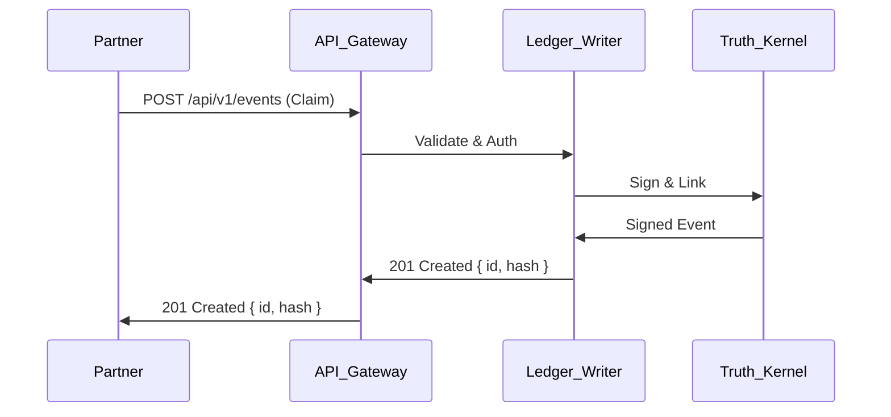

# Proveniq Ledger Integration Blueprint - Alpha Pilots

**Document ID:** `lead_architect_integration_blueprint_v1`  
**Phase:** 3 - Integration Sandbox & Alpha Pilots  
**Status:** APPROVED  
**Classification:** L3_TRADE_SECRET  
**Last Updated:** 2024-12-10  

---

## 1. Executive Summary

This blueprint defines the standard integration patterns for partners and internal applications connecting to Proveniq Ledger during the Alpha Pilot phase. It ensures secure, consistent, and observable interactions while enforcing the "Truth Kernel" as the single source of truth.

---

## 2. Integration Principles

### 2.1 The "Verify First" Rule

> **All integrations must verify the cryptographic proof of an event before trusting its content.**

Consumers should not blindly trust the JSON payload. They must:
1. Fetch the event.
2. Verify its signature.
3. (Optional) Verify its inclusion in the Merkle tree via the Proof API.

### 2.2 Integration Styles

| Style | Use Case | Latency | Complexity |
|-------|----------|---------|------------|
| **Synchronous API** | Event creation, immediate verification | Low (<500ms) | Low |
| **Webhooks** | Event notifications (async) | Medium (<5s) | Medium |
| **Polling** | Batch processing / low-volume checks | High (>1m) | Low |
| **Streaming** | High-volume real-time feed | Low (<1s) | High |

**Alpha Pilot Default:** Synchronous API for writes + Webhooks for notifications.

---

## 3. Standard Patterns

### 3.1 Pattern A: Synchronous Claim Submission

**Scenario:** Partner submits a claim and needs immediate confirmation it's on the Ledger.



**Requirements:**
- **Idempotency:** Partner must supply `X-Request-ID`.
- **Validation:** Strict schema validation on ingress.
- **Response:** Returns the canonical Ledger ID and Hash immediately.

### 3.2 Pattern B: Async Verification (Webhooks)

**Scenario:** Partner wants to know when a claim is processed or flagged by AI.

1.  **Subscription:** Partner registers a webhook endpoint via the Developer Portal.
2.  **Trigger:** Ledger processes an event (e.g., `RISK_ASSESSED`).
3.  **Delivery:** Ledger sends a signed `POST` request to the partner's endpoint.

**Payload:**
```json
{
  "eventId": "evt_123...",
  "eventType": "RISK_ASSESSED",
  "timestamp": "2024-12-10T12:00:00Z",
  "payload": { ... },
  "signature": "sig_abc..."
}
```

**Security:**
- Webhooks are signed with a shared secret (HMAC-SHA256).
- Partner **MUST** verify the signature header `X-Proveniq-Signature`.
- Retry policy: Exponential backoff (max 5 attempts).

### 3.3 Pattern C: Proof Verification (The "Trust Anchor")

**Scenario:** A regulator or auditor verifies a historical claim.

1.  **Fetch:** Auditor requests `GET /api/v1/proofs/{eventId}`.
2.  **Verify:** Auditor runs the `verifyMerkleProof` algorithm locally (or uses the SDK).
3.  **Result:** True/False confirmation of integrity.

---

## 4. API Surface Area (Alpha)

### 4.1 Ingress (Writes)

- `POST /api/v1/claims` - Submit a new claim.
- `POST /api/v1/documents` - Attach a document (returns hash).
- `POST /api/v1/verifications` - Record an external verification result.

### 4.2 Egress (Reads)

- `GET /api/v1/claims/{id}` - Get current claim state.
- `GET /api/v1/claims/{id}/history` - Get full event history.
- `GET /api/v1/proofs/{eventId}` - Get cryptographic proof.

---

## 5. Security & Isolation

### 5.1 Tenant Isolation

- **Data:** All events are tagged with `partnerId`.
- **Access:** API keys are scoped to a single `partnerId`.
- **Reads:** Partners can ONLY read events where `partnerId` matches their token.
- **Cross-Tenant:** Strictly prohibited in Alpha.

### 5.2 Rate Limiting (Sandbox Defaults)

| Tier | Rate Limit | Burst |
|------|------------|-------|
| **Sandbox** | 10 requests/sec | 50 |
| **Alpha Pilot** | 100 requests/sec | 500 |

---

## 6. Data Egress & Cost Controls

### 6.1 Throttling

To prevent unbounded costs:
- **Pagination:** All list endpoints enforce `limit=50` (max 100).
- **Webhook Quota:** Max 10,000 deliveries/day per partner in Sandbox.

### 6.2 Data Retention

- **Sandbox:** Data TTL = 30 days.
- **Alpha:** Data TTL = 1 year (or per compliance matrix).

---

## 7. Approval

| Role | Status | Date |
|------|--------|------|
| Lead Architect | ✅ APPROVED | 2024-12-10 |
| CTO | ⏳ PENDING | - |

