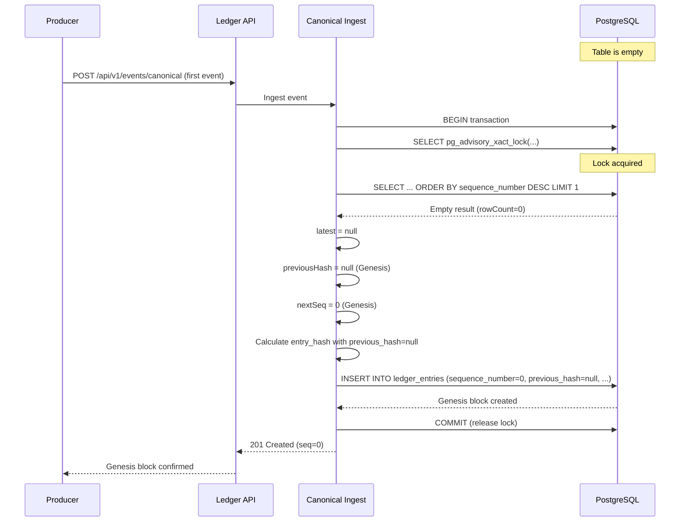

# PROVENIQ Memory (Ledger) - Genesis Procedure

**Last Verified Against Commit:** `4146303`  
**Schema Version:** 1.0.0

---

## Executive Summary

This document describes the **Genesis Procedure** for PROVENIQ Memory (Ledger) - the process of establishing the root of trust for a new ledger chain. The Genesis block is the first entry in the chain and serves as the foundation for all subsequent entries.

**Genesis Principle:** The first entry has no predecessor and establishes the chain's origin.

---

## Genesis Block Definition

### Characteristics

| Property | Value | Rationale |
|----------|-------|-----------|
| `sequence_number` | `0` | First entry in sequence |
| `previous_hash` | `null` | No predecessor exists |
| `entry_hash` | SHA-256 of entry data | Establishes first link |
| `created_at` | Server timestamp | Records chain inception |

**Status:** [SHIPPED]

**Source:** `backend/src/ingest/canonical.ts`

---

### Genesis Block Structure

```json
{
  "id": "uuid-v4",
  "sequence_number": 0,
  "source": "system",
  "event_type": "LEDGER_GENESIS_CREATED",
  "correlation_id": "uuid-v4",
  "asset_id": null,
  "anchor_id": null,
  "actor_id": null,
  "payload": {
    "network_id": "proveniq-prod",
    "schema_version": "1.0.0",
    "genesis_timestamp": "2024-12-29T12:00:00Z"
  },
  "payload_hash": "sha256-hex",
  "previous_hash": null,
  "entry_hash": "sha256-hex",
  "created_at": "2024-12-29T12:00:00Z"
}
```

**Status:** [UNKNOWN - Genesis event type not in registered events]

---

## Empty State Initialization

### Automatic Genesis Handling

**Source:** `backend/src/ingest/canonical.ts`

```typescript
// Read latest entry (safe - advisory lock held)
const latestResult = await client.query(
  `SELECT sequence_number, entry_hash
   FROM ledger_entries
   ORDER BY sequence_number DESC
   LIMIT 1`
);

const latest = latestResult.rowCount === 1 ? latestResult.rows[0] : null;
const previousHash: string | null = latest?.entry_hash ?? null;
const nextSeq: number = (latest?.sequence_number ?? -1) + 1;
```

**Behavior:**
- If table is empty (`rowCount === 0`), `latest = null`
- `previousHash = null` (Genesis condition)
- `nextSeq = 0` (First sequence number)

**Status:** [SHIPPED]

**Enforcement:** Machine-Enforced (Hard) via code logic

---

### Advisory Lock Compatibility

**Critical:** Advisory lock works even when table is empty

**Source:** `backend/src/ingest/canonical.ts`

```typescript
// CRITICAL: Acquire transaction-scoped advisory lock
await client.query(
  'SELECT pg_advisory_xact_lock($1, $2)',
  [0x5052564e, 0x4c454447] // "PRVN", "LEDG"
);
```

**Behavior:**
- Lock is acquired on lock keys, not table rows
- Works when `ledger_entries` table is empty
- First write creates Genesis block atomically

**Status:** [SHIPPED]

**Enforcement:** Machine-Enforced (Hard) via PostgreSQL

---

## Genesis Creation Flow



**Status:** [SHIPPED]

---

## Determinism Requirements

### Hash Calculation Determinism

**Requirement:** Genesis block hash must be deterministic

**Source:** `backend/src/ingest/canonical.ts`

```typescript
function hashEntry(
  payloadHash: string,
  previousHash: string | null,
  sequenceNumber: number,
  eventId: string
): string {
  // Deterministic serialization - field order matters
  const material = JSON.stringify({
    previous_hash: previousHash,  // null for Genesis
    payload_hash: payloadHash,
    sequence_number: sequenceNumber,  // 0 for Genesis
    event_id: eventId,
  });
  
  return createHash('sha256').update(material).digest('hex');
}
```

**Genesis Hash Input:**
```json
{
  "previous_hash": null,
  "payload_hash": "sha256-of-payload",
  "sequence_number": 0,
  "event_id": "uuid-v4"
}
```

**Determinism Guarantee:** Same inputs always produce same hash

**Status:** [SHIPPED]

**Enforcement:** Machine-Enforced (Hard) via cryptography

---

### Timestamp Non-Determinism

**Issue:** `created_at` is server-set timestamp (non-deterministic)

**Impact:** Genesis block cannot be reproduced exactly

**Mitigation:** Hash does NOT include `created_at` in canonical implementation

**Status:** [SHIPPED]

**Note:** Legacy implementation includes `created_at` in hash (non-deterministic)

---

## Irreversibility Guarantees

### Cannot Delete Genesis

**Mechanism:** WORM trigger prevents DELETE

```sql
DELETE FROM ledger_entries WHERE sequence_number = 0;
```

**Result:**
```
ERROR:  DELETE operations are forbidden on ledger_entries (WORM enforcement)
```

**Status:** [SHIPPED]

**Enforcement:** Machine-Enforced (Hard)

---

### Cannot Modify Genesis

**Mechanism:** WORM trigger prevents UPDATE

```sql
UPDATE ledger_entries SET previous_hash = 'fake-hash' WHERE sequence_number = 0;
```

**Result:**
```
ERROR:  UPDATE operations are forbidden on ledger_entries (WORM enforcement)
```

**Status:** [SHIPPED]

**Enforcement:** Machine-Enforced (Hard)

---

### Cannot Recreate Genesis

**Mechanism:** UNIQUE constraint on `sequence_number`

```sql
INSERT INTO ledger_entries (sequence_number, ...) VALUES (0, ...);
```

**Result (if Genesis exists):**
```
ERROR:  duplicate key value violates unique constraint "ledger_entries_sequence_unique"
```

**Status:** [SHIPPED]

**Enforcement:** Machine-Enforced (Hard)

---

## Genesis Verification

### Manual Verification

**Query Genesis Block:**
```sql
SELECT id, sequence_number, previous_hash, entry_hash, created_at
FROM ledger_entries
WHERE sequence_number = 0;
```

**Expected Result:**
```
id                                   | sequence_number | previous_hash | entry_hash | created_at
-------------------------------------+-----------------+---------------+------------+------------
uuid-v4                              | 0               | null          | sha256-hex | timestamp
```

**Verification Checks:**
1. ✅ `sequence_number = 0`
2. ✅ `previous_hash IS NULL`
3. ✅ `entry_hash` is 64-character hex string
4. ✅ Only one row returned (uniqueness)

---

### Automated Verification

**Source:** `backend/src/verify-integrity.ts`

```typescript
function verifyChainLink(
  currentEntry: LedgerEntry,
  previousEntry: LedgerEntry | null
): boolean {
  if (previousEntry === null) {
    // Genesis block - previous_hash should be null
    return currentEntry.previous_hash === null;
  }
  
  // Non-genesis - previous_hash should match previous entry's entry_hash
  return currentEntry.previous_hash === previousEntry.entry_hash;
}
```

**Genesis Verification:**
- First entry in chain has `previousEntry = null`
- Verification passes if `currentEntry.previous_hash === null`
- Verification fails if `currentEntry.previous_hash !== null`

**Status:** [SHIPPED]

---

## Multi-Network Isolation

### Network ID Purpose

**Environment Variable:** `LEDGER_NETWORK_ID`

**Purpose:** Prevent cross-network event mixing

**Examples:**
- `proveniq-prod` (production)
- `proveniq-staging` (staging)
- `proveniq-dev` (development)

**Status:** [SHIPPED]

**Enforcement:** Policy-Enforced (Soft) - not stored in database

---

### Network Isolation Guarantees

**What IS Isolated:**
- Different `LEDGER_NETWORK_ID` values prevent cross-network writes
- Each network has its own Genesis block
- Events cannot be replayed across networks (different network context)

**What IS NOT Isolated:**
- Database-level isolation (same PostgreSQL instance)
- No database constraint enforcing network ID
- Application-level validation only

**Status:** [POLICY-ENFORCED]

**Recommendation:** Use separate databases for production/staging/development

---

## Genesis Recovery Scenarios

### Scenario 1: Accidental Genesis Deletion

**Cause:** Database superuser bypasses WORM trigger and deletes Genesis

**Detection:** Integrity verification fails (first entry has non-null `previous_hash`)

**Recovery:**
1. **HALT ALL WRITES** - Prevent further corruption
2. **RESTORE FROM BACKUP** - Use last known good backup
3. **VERIFY INTEGRITY** - Confirm Genesis is restored
4. **INVESTIGATE** - Determine how deletion occurred
5. **PREVENT RECURRENCE** - Restrict superuser access

**Status:** [POLICY-ENFORCED]

---

### Scenario 2: Corrupted Genesis Hash

**Cause:** Database tampering modifies Genesis `entry_hash`

**Detection:** Integrity verification fails (Genesis hash mismatch)

**Recovery:**
1. **HALT ALL WRITES**
2. **RESTORE FROM BACKUP**
3. **VERIFY INTEGRITY**
4. **AUDIT DATABASE ACCESS** - Review superuser activity
5. **STRENGTHEN ACCESS CONTROLS**

**Status:** [POLICY-ENFORCED]

---

### Scenario 3: Multiple Genesis Blocks

**Cause:** UNIQUE constraint dropped, allowing duplicate `sequence_number = 0`

**Detection:** Query returns multiple rows for `sequence_number = 0`

**Recovery:**
1. **HALT ALL WRITES**
2. **IDENTIFY CORRECT GENESIS** - Use `created_at` timestamp
3. **DELETE DUPLICATE** - Requires superuser with trigger bypass
4. **RESTORE UNIQUE CONSTRAINT**
5. **VERIFY INTEGRITY**

**Status:** [POLICY-ENFORCED]

---

## Genesis Best Practices

### Production Deployment

**Checklist:**
- [ ] Database is empty (no existing entries)
- [ ] WORM triggers are active
- [ ] UNIQUE constraints are active
- [ ] Advisory lock is functional
- [ ] Environment validation passes
- [ ] First event is ready (Genesis event)
- [ ] Backup strategy is configured
- [ ] Monitoring is active

---

### Genesis Event Recommendations

**Recommended Genesis Event:**
```json
{
  "schema_version": "1.0.0",
  "event_type": "CORE_LEDGER_INITIALIZED",
  "occurred_at": "2024-12-29T12:00:00Z",
  "correlation_id": "uuid-v4",
  "idempotency_key": "genesis-proveniq-prod-2024-12-29",
  "producer": "core",
  "producer_version": "1.0.0",
  "subject": {
    "asset_id": "00000000-0000-0000-0000-000000000000"
  },
  "payload": {
    "network_id": "proveniq-prod",
    "schema_version": "1.0.0",
    "initialized_at": "2024-12-29T12:00:00Z",
    "initialized_by": "system"
  },
  "canonical_hash_hex": "sha256-of-payload"
}
```

**Status:** [UNKNOWN - event type not registered]

---

### Genesis Documentation

**Required Documentation:**
- Genesis timestamp (when chain was created)
- Genesis event ID (UUID)
- Genesis entry hash (SHA-256)
- Network ID (which network this chain belongs to)
- Deployment environment (production, staging, development)
- Responsible party (who initialized the chain)

**Storage:** Secure documentation repository (not in ledger)

---

## Genesis vs. Checkpoint

### Comparison

| Aspect | Genesis | Checkpoint |
|--------|---------|------------|
| **Purpose** | Establish chain origin | Snapshot for verification |
| **Sequence** | Always 0 | Any sequence number |
| **Previous Hash** | Always null | References previous entry |
| **Frequency** | Once per chain | Periodic (monthly, quarterly) |
| **Immutability** | Cannot be recreated | Can create new checkpoints |
| **Verification** | Required for full chain | Optional (speeds up verification) |

**Status:** [SHIPPED - Genesis, UNKNOWN - Checkpoints]

---

## Testing Genesis Creation

### Test Procedure

**1. Prepare Empty Database:**
```sql
-- WARNING: Destructive operation
TRUNCATE TABLE ledger_entries CASCADE;
TRUNCATE TABLE audit_log CASCADE;
TRUNCATE TABLE integrity_checkpoints CASCADE;
```

**2. Submit First Event:**
```bash
curl -X POST http://localhost:8006/api/v1/events/canonical \
  -H "x-api-key: $ADMIN_API_KEY" \
  -H "Content-Type: application/json" \
  -d @genesis-event.json
```

**3. Verify Genesis:**
```sql
SELECT sequence_number, previous_hash, entry_hash
FROM ledger_entries
WHERE sequence_number = 0;
```

**Expected:**
- `sequence_number = 0`
- `previous_hash IS NULL`
- `entry_hash` is valid SHA-256 hex

**4. Run Integrity Verification:**
```bash
npm run verify-integrity
```

**Expected:** Exit code 0 (valid)

---

## Genesis Security Considerations

### Threat: Genesis Tampering

**Attack:** Modify Genesis block to alter chain foundation

**Impact:** Entire chain becomes invalid

**Mitigation:**
- WORM triggers prevent modification
- Integrity verification detects tampering
- Backup Genesis block metadata externally

**Status:** [SHIPPED]

---

### Threat: Genesis Deletion

**Attack:** Delete Genesis block to corrupt chain

**Impact:** Chain becomes invalid (first entry has non-null `previous_hash`)

**Mitigation:**
- WORM triggers prevent deletion
- Integrity verification detects missing Genesis
- Restore from backup

**Status:** [SHIPPED]

---

### Threat: Genesis Replay

**Attack:** Replay Genesis event to create duplicate

**Impact:** Duplicate sequence number (constraint violation)

**Mitigation:**
- UNIQUE constraint on `sequence_number`
- Idempotency key prevents replay
- Advisory lock prevents concurrent Genesis creation

**Status:** [SHIPPED]

---

## Genesis Monitoring

### Critical Alerts

**Genesis Modified:**
```sql
-- Alert if Genesis previous_hash is not null
SELECT id, sequence_number, previous_hash
FROM ledger_entries
WHERE sequence_number = 0
  AND previous_hash IS NOT NULL;
```

**Action:** Immediate investigation and restore from backup

---

**Genesis Missing:**
```sql
-- Alert if no Genesis block exists
SELECT COUNT(*) FROM ledger_entries WHERE sequence_number = 0;
-- Expected: 1
```

**Action:** Immediate investigation and restore from backup

---

**Multiple Genesis:**
```sql
-- Alert if multiple Genesis blocks exist
SELECT COUNT(*) FROM ledger_entries WHERE sequence_number = 0;
-- Expected: 1, Alert if > 1
```

**Action:** Immediate investigation and remove duplicates

---

## Summary

**Genesis Block Guarantees:**
- ✅ First entry has `sequence_number = 0`
- ✅ First entry has `previous_hash = null`
- ✅ First entry establishes chain origin
- ✅ Cannot be modified (WORM trigger)
- ✅ Cannot be deleted (WORM trigger)
- ✅ Cannot be duplicated (UNIQUE constraint)
- ✅ Advisory lock works with empty table
- ✅ Deterministic hash calculation
- ✅ Integrity verification validates Genesis

**All guarantees are MACHINE-ENFORCED (Hard), not POLICY-ENFORCED (Soft)**

---

**Last Verified Against Commit:** `4146303`  
**Schema Version:** 1.0.0
