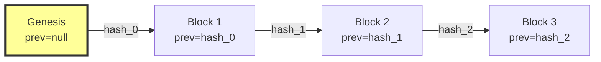

# PROVENIQ Memory (Ledger) - Immutability Guarantees

**Last Verified Against Commit:** `4146303`  
**Schema Version:** 1.0.0

---

## Executive Summary

This document catalogs the **immutability guarantees** provided by PROVENIQ Memory (Ledger). All guarantees are **machine-enforced** through database constraints, triggers, and cryptography - not policy-enforced through organizational procedures.

**Core Principle:** Events are immutable facts. Once written, they cannot be modified, deleted, or reordered.

---

## WORM Enforcement (Write Once, Read Many)

### Database-Level Enforcement

**Source:** `backend/migrations/001_immutability_constraints.sql`

**Mechanism:** PostgreSQL BEFORE UPDATE/DELETE triggers

```sql
CREATE OR REPLACE FUNCTION prevent_ledger_mutation()
RETURNS TRIGGER AS $$
BEGIN
  IF (TG_OP = 'UPDATE') THEN
    RAISE EXCEPTION 'UPDATE operations are forbidden on ledger_entries (WORM enforcement)'
      USING ERRCODE = 'integrity_constraint_violation';
  END IF;

  IF (TG_OP = 'DELETE') THEN
    RAISE EXCEPTION 'DELETE operations are forbidden on ledger_entries (WORM enforcement)'
      USING ERRCODE = 'integrity_constraint_violation';
  END IF;

  RETURN OLD;
END;
$$ LANGUAGE plpgsql;

CREATE TRIGGER enforce_ledger_immutability
  BEFORE UPDATE OR DELETE ON ledger_entries
  FOR EACH ROW
  EXECUTE FUNCTION prevent_ledger_mutation();
```

**Status:** [SHIPPED]

**Enforcement:** Machine-Enforced (Hard)

---

### Trigger Behavior

**UPDATE Attempt:**
```sql
UPDATE ledger_entries SET payload = '{}' WHERE id = '...';
```

**Result:**
```
ERROR:  UPDATE operations are forbidden on ledger_entries (WORM enforcement). Table: ledger_entries, Operation: UPDATE
HINT:  Ledger entries are immutable. Create a new event instead.
```

**DELETE Attempt:**
```sql
DELETE FROM ledger_entries WHERE id = '...';
```

**Result:**
```
ERROR:  DELETE operations are forbidden on ledger_entries (WORM enforcement). Table: ledger_entries, Operation: DELETE
HINT:  Ledger entries are immutable. They cannot be deleted.
```

**Status:** [SHIPPED]

---

### Audit Log Protection

**Table:** `audit_log`

**Protection:** Same WORM triggers as `ledger_entries`

```sql
CREATE TRIGGER enforce_audit_immutability
  BEFORE UPDATE OR DELETE ON audit_log
  FOR EACH ROW
  EXECUTE FUNCTION prevent_audit_mutation();
```

**Purpose:** Prevent tampering with audit trail

**Status:** [SHIPPED]

**Enforcement:** Machine-Enforced (Hard)

---

## Replay Protection

### Unique Constraints

**Source:** `backend/migrations/001_immutability_constraints.sql`

| Constraint | Column | Purpose | Enforcement |
|------------|--------|---------|-------------|
| `ledger_entries_sequence_unique` | `sequence_number` | Prevent duplicate sequences | Machine-Enforced |
| `ledger_entries_event_id_unique` | `id` (PRIMARY KEY) | Prevent duplicate event IDs | Machine-Enforced |
| Partial unique index | `idempotency_key` | Prevent duplicate client keys | Machine-Enforced |

**Status:** [SHIPPED]

---

### Sequence Number Uniqueness

```sql
ALTER TABLE ledger_entries
  ADD CONSTRAINT ledger_entries_sequence_unique 
  UNIQUE (sequence_number);
```

**Guarantee:** No two entries can have the same sequence number

**Violation Behavior:**
```sql
INSERT INTO ledger_entries (sequence_number, ...) VALUES (123, ...);
-- First insert: Success
INSERT INTO ledger_entries (sequence_number, ...) VALUES (123, ...);
-- Second insert: ERROR: duplicate key value violates unique constraint
```

**Status:** [SHIPPED]

**Enforcement:** Machine-Enforced (Hard)

---

### Event ID Uniqueness

```sql
ALTER TABLE ledger_entries
  ADD CONSTRAINT ledger_entries_event_id_unique 
  UNIQUE (id);
```

**Guarantee:** No two entries can have the same event ID (UUID)

**Note:** This is enforced by PRIMARY KEY constraint

**Status:** [SHIPPED]

**Enforcement:** Machine-Enforced (Hard)

---

### Idempotency Key Uniqueness

```sql
CREATE UNIQUE INDEX idx_ledger_idempotency_key 
  ON ledger_entries(idempotency_key) 
  WHERE idempotency_key IS NOT NULL;
```

**Guarantee:** No two entries can have the same client-provided idempotency key

**Partial Index:** Only enforces uniqueness when `idempotency_key IS NOT NULL`

**Behavior:**
- First submission with key "abc123": Success (201 Created)
- Second submission with key "abc123": Success (200 OK, idempotent=true)
- Returns same sequence_number and entry_hash

**Status:** [SHIPPED]

**Enforcement:** Machine-Enforced (Hard)

---

## Hash Chain Integrity

### Cryptographic Linkage

**Algorithm:** SHA-256 hash chaining

**Linkage Formula:**
```
entry_hash = SHA256(payload_hash | previous_hash | source | event_type | timestamp)
```

**Source:** `backend/src/ingest/canonical.ts`



**Guarantee:** Any modification to an entry invalidates all subsequent entries

**Status:** [SHIPPED]

**Enforcement:** Machine-Enforced (Hard) via cryptography

---

### Tamper Detection

**Scenario:** Attacker modifies entry at sequence 100

**Effect:**
- Entry 100's `entry_hash` no longer matches recomputed hash
- Entry 101's `previous_hash` no longer matches entry 100's `entry_hash`
- All entries 101+ fail chain linkage verification

**Detection:** Integrity verification script detects chain break

**Status:** [SHIPPED]

**Enforcement:** Machine-Enforced (Hard) via cryptography

---

## Concurrency Safety

### Advisory Lock Serialization

**Source:** `backend/src/ingest/canonical.ts`

**Mechanism:** PostgreSQL `pg_advisory_xact_lock`

```typescript
await client.query('BEGIN');

// CRITICAL: Acquire transaction-scoped advisory lock
await client.query(
  'SELECT pg_advisory_xact_lock($1, $2)',
  [0x5052564e, 0x4c454447] // "PRVN", "LEDG"
);

// Read latest entry (safe - lock held)
const latest = await client.query(
  'SELECT sequence_number, entry_hash FROM ledger_entries ORDER BY sequence_number DESC LIMIT 1'
);

// Calculate hash (deterministic)
const entryHash = hashEntry(payloadHash, latest.entry_hash, ...);

// Insert new entry
await client.query('INSERT INTO ledger_entries ...');

await client.query('COMMIT'); // Lock released automatically
```

**Guarantee:** Only one canonical write executes at a time

**Status:** [SHIPPED]

**Enforcement:** Machine-Enforced (Hard) via database lock

---

### Lock Characteristics

| Property | Value | Source |
|----------|-------|--------|
| **Lock Type** | Advisory (not row-level) | PostgreSQL |
| **Scope** | Transaction-scoped | `pg_advisory_xact_lock` |
| **Release** | Automatic on COMMIT/ROLLBACK | PostgreSQL |
| **Blocking** | Yes (other writers wait) | PostgreSQL |
| **Timeout** | None (waits indefinitely) | [UNKNOWN] |

**Status:** [SHIPPED]

---

### Fork Prevention

**Without Advisory Lock (Vulnerable):**
```
Time    Thread A                    Thread B
----    --------                    --------
T1      Read latest (seq=100)
T2                                  Read latest (seq=100)
T3      Calculate hash(prev=100)
T4                                  Calculate hash(prev=100)
T5      INSERT seq=101
T6                                  INSERT seq=102 ❌ FORK
```

**With Advisory Lock (Safe):**
```
Time    Thread A                    Thread B
----    --------                    --------
T1      Acquire lock
T2                                  Wait for lock...
T3      Read latest (seq=100)
T4      Calculate hash(prev=100)
T5      INSERT seq=101
T6      COMMIT (release lock)
T7                                  Acquire lock
T8                                  Read latest (seq=101)
T9                                  Calculate hash(prev=101)
T10                                 INSERT seq=102 ✅ VALID
```

**Guarantee:** Hash chain forks are impossible

**Status:** [SHIPPED]

**Enforcement:** Machine-Enforced (Hard)

---

## Impossibilities Catalog

### Operations That Cannot Be Performed

| Operation | Mechanism | Enforcement | Bypass Possible? |
|-----------|-----------|-------------|------------------|
| **Modify event payload** | WORM trigger | Machine-Enforced | Only by database superuser with trigger bypass |
| **Modify event metadata** | WORM trigger | Machine-Enforced | Only by database superuser with trigger bypass |
| **Delete events** | WORM trigger | Machine-Enforced | Only by database superuser with trigger bypass |
| **Reorder events** | Immutable sequence_number | Machine-Enforced | No (sequence is immutable) |
| **Create duplicate sequences** | UNIQUE constraint | Machine-Enforced | No (constraint violation) |
| **Create duplicate event IDs** | PRIMARY KEY constraint | Machine-Enforced | No (constraint violation) |
| **Create duplicate idempotency keys** | Partial UNIQUE index | Machine-Enforced | No (constraint violation) |
| **Fork hash chain** | Advisory lock | Machine-Enforced | No (serialized writes) |
| **Break hash chain** | Cryptographic linkage | Machine-Enforced | Detectable via verification |
| **Modify audit log** | WORM trigger | Machine-Enforced | Only by database superuser with trigger bypass |

**Status:** [SHIPPED]

---

### Bypass Scenarios

**Database Superuser with Trigger Bypass:**

```sql
-- Disable trigger (requires superuser)
ALTER TABLE ledger_entries DISABLE TRIGGER enforce_ledger_immutability;

-- Modify entry (now possible)
UPDATE ledger_entries SET payload = '{}' WHERE id = '...';

-- Re-enable trigger
ALTER TABLE ledger_entries ENABLE TRIGGER enforce_ledger_immutability;
```

**Detection:** Integrity verification will detect hash chain break

**Mitigation:**
- Restrict superuser access
- Audit superuser actions
- Run integrity verification regularly
- Monitor trigger status

**Status:** [SHIPPED]

---

## Constraint Verification

### Manual Verification

**Check WORM Triggers:**
```sql
SELECT trigger_name, event_manipulation, action_statement
FROM information_schema.triggers
WHERE event_object_table = 'ledger_entries'
  AND trigger_name = 'enforce_ledger_immutability';
```

**Expected Output:**
```
trigger_name                 | event_manipulation | action_statement
-----------------------------+--------------------+------------------
enforce_ledger_immutability | UPDATE             | EXECUTE FUNCTION prevent_ledger_mutation()
enforce_ledger_immutability | DELETE             | EXECUTE FUNCTION prevent_ledger_mutation()
```

---

**Check Unique Constraints:**
```sql
SELECT constraint_name, constraint_type
FROM information_schema.table_constraints
WHERE table_name = 'ledger_entries'
  AND constraint_type = 'UNIQUE';
```

**Expected Output:**
```
constraint_name                  | constraint_type
---------------------------------+----------------
ledger_entries_sequence_unique  | UNIQUE
ledger_entries_event_id_unique  | UNIQUE
```

---

**Check Partial Unique Index:**
```sql
SELECT indexname, indexdef
FROM pg_indexes
WHERE tablename = 'ledger_entries'
  AND indexname = 'idx_ledger_idempotency_key';
```

**Expected Output:**
```
indexname                    | indexdef
-----------------------------+----------
idx_ledger_idempotency_key  | CREATE UNIQUE INDEX idx_ledger_idempotency_key ON ledger_entries USING btree (idempotency_key) WHERE (idempotency_key IS NOT NULL)
```

---

### Automated Verification

**Source:** `backend/migrations/001_immutability_constraints.sql`

```sql
DO $$
DECLARE
  constraint_count INTEGER;
  trigger_count INTEGER;
BEGIN
  -- Check unique constraints
  SELECT COUNT(*) INTO constraint_count
  FROM information_schema.table_constraints
  WHERE table_name = 'ledger_entries'
    AND constraint_type = 'UNIQUE'
    AND constraint_name IN ('ledger_entries_sequence_unique', 'ledger_entries_event_id_unique');

  IF constraint_count < 2 THEN
    RAISE WARNING 'Expected 2 unique constraints on ledger_entries, found %', constraint_count;
  END IF;

  -- Check WORM triggers
  SELECT COUNT(*) INTO trigger_count
  FROM information_schema.triggers
  WHERE event_object_table = 'ledger_entries'
    AND trigger_name = 'enforce_ledger_immutability';

  IF trigger_count = 0 THEN
    RAISE WARNING 'WORM trigger not found on ledger_entries';
  END IF;

  RAISE NOTICE '✅ Immutability constraints verified: % unique constraints, % WORM triggers', constraint_count, trigger_count;
END $$;
```

**Status:** [SHIPPED]

**Runs:** Automatically during migration

---

## Compliance Implications

### GDPR "Right to be Forgotten"

**Conflict:** GDPR Article 17 grants individuals the right to erasure of personal data

**Ledger Behavior:** Events cannot be deleted (WORM enforcement)

**Resolution:**
- **Do NOT store PII in event payloads** [POLICY-ENFORCED]
- Store PII in separate tables with foreign keys to ledger
- Delete PII from separate tables while preserving ledger events
- Ledger events reference deleted data via UUID (no PII exposure)

**Status:** [POLICY-ENFORCED]

---

### SOC 2 - Change Management

**Control:** CC8.1 - The entity authorizes, designs, develops, configures, documents, tests, approves, and implements changes to infrastructure, data, software, and procedures to meet its objectives.

**Ledger Alignment:** Immutable events provide audit trail of all changes

**Evidence:**
- WORM triggers prevent unauthorized modifications
- Hash chain detects tampering
- Audit log records all access

**Status:** [SHIPPED]

---

### HIPAA - Integrity Controls

**Control:** §164.312(c)(1) - Implement policies and procedures to protect electronic protected health information from improper alteration or destruction.

**Ledger Alignment:** Hash chain cryptographically proves data has not been altered

**Evidence:**
- WORM triggers prevent alteration
- Integrity verification detects tampering
- Audit log records access attempts

**Status:** [SHIPPED]

---

## Migration Safety

### Forward-Only Migrations

**Policy:** All database migrations must be forward-only (no rollbacks)

**Rationale:** Immutable data cannot be safely rolled back

**Prohibited Operations:**
- `DROP COLUMN` on `ledger_entries`
- `ALTER COLUMN TYPE` on `ledger_entries`
- Data mutation on `ledger_entries`
- Trigger removal without replacement

**Allowed Operations:**
- `ADD COLUMN` (with default value)
- `CREATE INDEX`
- `CREATE TRIGGER`
- Schema version updates

**Status:** [POLICY-ENFORCED]

---

### Migration Testing

**Required Tests:**
1. **WORM Trigger Test:** Verify UPDATE/DELETE fail
2. **Unique Constraint Test:** Verify duplicate prevention
3. **Integrity Verification:** Verify hash chain intact
4. **Idempotency Test:** Verify duplicate submissions handled

**Status:** [POLICY-ENFORCED]

---

## Monitoring and Alerting

### Critical Alerts

**Trigger Disabled:**
```sql
-- Alert if trigger is disabled
SELECT trigger_name
FROM information_schema.triggers
WHERE event_object_table = 'ledger_entries'
  AND trigger_name = 'enforce_ledger_immutability'
  AND status = 'DISABLED';
```

**Action:** Immediate investigation and re-enable

---

**Constraint Dropped:**
```sql
-- Alert if unique constraint is missing
SELECT constraint_name
FROM information_schema.table_constraints
WHERE table_name = 'ledger_entries'
  AND constraint_type = 'UNIQUE'
  AND constraint_name IN ('ledger_entries_sequence_unique', 'ledger_entries_event_id_unique');
```

**Action:** Immediate investigation and restore

---

**Integrity Verification Failure:**
```bash
# Alert if verification script exits with code 1
npm run verify-integrity
if [ $? -eq 1 ]; then
  echo "CRITICAL: Ledger integrity violation detected"
  # Trigger incident response
fi
```

**Action:** Halt writes, investigate, restore from backup

---

## Immutability vs. Correctability

### The Tradeoff

**Immutability Benefit:** Cryptographic proof of data integrity

**Immutability Cost:** Cannot correct errors

**Example Scenario:**
- Event ingested with incorrect payload
- Payload contains wrong `work_order_id`
- Cannot modify event to fix error

**Resolution Options:**

1. **Compensating Event (Recommended):**
   ```json
   {
     "event_type": "SERVICE_RECORD_CORRECTED",
     "payload": {
       "original_event_id": "uuid-of-wrong-event",
       "corrected_work_order_id": "correct-uuid",
       "reason": "Data entry error"
     }
   }
   ```

2. **Application-Level Filtering:**
   - Mark event as "superseded" in application state
   - Do not modify ledger entry
   - Query logic filters superseded events

3. **Accept Error:**
   - Document error in audit log
   - Do not attempt correction
   - Use as learning opportunity

**Status:** [POLICY-ENFORCED]

---

## Testing Immutability

### Test Suite

**1. WORM Trigger Test:**
```sql
-- Should fail
BEGIN;
INSERT INTO ledger_entries (...) VALUES (...) RETURNING id;
UPDATE ledger_entries SET payload = '{}' WHERE id = <returned_id>;
ROLLBACK;
```

**Expected:** `integrity_constraint_violation` error

---

**2. Unique Sequence Test:**
```sql
-- Should fail on second insert
BEGIN;
INSERT INTO ledger_entries (sequence_number, ...) VALUES (999999, ...);
INSERT INTO ledger_entries (sequence_number, ...) VALUES (999999, ...);
ROLLBACK;
```

**Expected:** `duplicate key value violates unique constraint` error

---

**3. Idempotency Test:**
```bash
# Should return same sequence_number
curl -X POST /api/v1/events/canonical -d @event.json
# Response: { sequence_number: 123, idempotent: false }

curl -X POST /api/v1/events/canonical -d @event.json
# Response: { sequence_number: 123, idempotent: true }
```

**Expected:** Same sequence_number, `idempotent: true` on second call

---

**4. Integrity Verification Test:**
```bash
npm run verify-integrity
# Expected: Exit code 0 (valid)
```

---

## Summary of Guarantees

| Guarantee | Mechanism | Enforcement | Bypass | Detection |
|-----------|-----------|-------------|--------|-----------|
| **No event modification** | WORM trigger | Machine-Enforced | Superuser only | Integrity verification |
| **No event deletion** | WORM trigger | Machine-Enforced | Superuser only | Sequence gap detection |
| **No sequence duplication** | UNIQUE constraint | Machine-Enforced | None | Constraint violation |
| **No event ID duplication** | PRIMARY KEY | Machine-Enforced | None | Constraint violation |
| **No idempotency key duplication** | Partial UNIQUE index | Machine-Enforced | None | Constraint violation |
| **No hash chain forks** | Advisory lock | Machine-Enforced | None | Integrity verification |
| **No audit log tampering** | WORM trigger | Machine-Enforced | Superuser only | Audit log verification |

**All guarantees are MACHINE-ENFORCED (Hard), not POLICY-ENFORCED (Soft)**

---

**Last Verified Against Commit:** `4146303`  
**Schema Version:** 1.0.0
