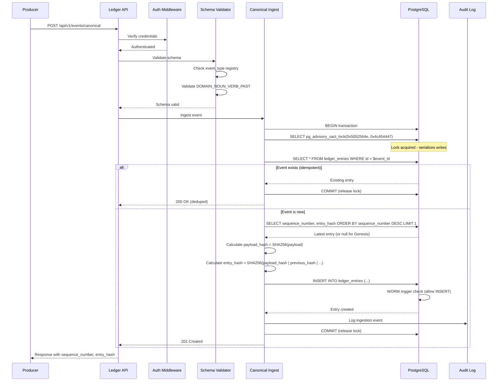

# PROVENIQ Memory (Ledger) - Architecture Overview

**Last Verified Against Commit:** `4146303`  
**Schema Version:** 1.0.0

---

## Executive Summary

PROVENIQ Memory is a **cryptographic event ledger** that serves as the immutable system of record for all physical asset events across the PROVENIQ ecosystem. It provides verifiable proof of asset provenance, custody, condition, and lifecycle events through SHA-256 hash chaining and database-enforced immutability.

**Architecture Pattern:** Event-sourced append-only log with cryptographic integrity guarantees

**Deployment Model:** Single-instance Node.js service with PostgreSQL backend

---

## System Context Diagram


---

## Component Architecture

### Core Components


**Component Descriptions:**

| Component | Purpose | Implementation | Status |
|-----------|---------|----------------|--------|
| **Express API Server** | HTTP request handling | Express.js 4.19+ | [SHIPPED] |
| **Authentication Middleware** | Dual auth (Firebase + API Key) | `backend/src/auth.ts` | [SHIPPED] |
| **Schema Validation** | Zod-based event validation | `backend/src/ledger.events.ts` | [SHIPPED] |
| **Canonical Ingestion** | Advisory lock-based write path | `backend/src/ingest/canonical.ts` | [SHIPPED] |
| **Query Engine** | Filtered event retrieval | `backend/src/server.ts` | [SHIPPED] |
| **Integrity Verification** | Hash chain validation | `backend/src/verify-integrity.ts` | [SHIPPED] |
| **Event Bus** | Pub/sub event distribution | `backend/src/event-bus.ts` | [SHIPPED] |
| **WORM Triggers** | Immutability enforcement | `backend/migrations/001_immutability_constraints.sql` | [SHIPPED] |
| **Advisory Locks** | Concurrency safety | PostgreSQL `pg_advisory_xact_lock` | [SHIPPED] |

---

## Data Flow Patterns

### Canonical Event Ingestion Flow



**Critical Path Characteristics:**
- **Latency:** ~50-100ms (single database round-trip) [UNKNOWN - not measured in code]
- **Throughput:** Serialized writes (one at a time) [SHIPPED]
- **Failure Mode:** Transaction rollback on any error [SHIPPED]

---

### Event Query Flow


**Query Capabilities:** [SHIPPED]
- Filter by: `source`, `event_type`, `asset_id`, `anchor_id`, `correlation_id`
- Date range: `from_date`, `to_date`
- Sequence range: `from_sequence`, `to_sequence`
- Pagination: `limit` (max 1000), `offset`

---

### Integrity Verification Flow


**Verification Guarantees:**
- Detects payload tampering [SHIPPED]
- Detects hash chain breaks [SHIPPED]
- Detects sequence gaps [SHIPPED]
- Detects entry hash mismatches [SHIPPED]

---

## Integration Points

### Producer Integration

**Endpoint:** `POST /api/v1/events/canonical`

**Authentication:** Firebase ID Token OR Admin API Key

**Request Schema:**
```typescript
{
  schema_version: "1.0.0",
  event_type: "DOMAIN_NOUN_VERB_PAST",
  occurred_at: "2024-12-29T12:00:00Z",
  correlation_id: "uuid",
  idempotency_key: "unique-string",
  producer: "service-name",
  producer_version: "1.0.0",
  subject: {
    asset_id: "uuid",
    anchor_id?: "string",
    // ... other IDs
  },
  payload: { /* event-specific data */ },
  canonical_hash_hex: "sha256-hex",
  signatures?: {
    device_sig?: "ed25519-hex",
    provider_sig?: "ed25519-hex"
  }
}
```

**Response (Success):**
```json
{
  "event_id": "uuid",
  "sequence_number": 12345,
  "entry_hash": "sha256-hex",
  "committed_at": "2024-12-29T12:00:01Z",
  "schema_version": "1.0.0",
  "idempotent": false
}
```

**Response (Duplicate):**
```json
{
  "event_id": "uuid",
  "sequence_number": 12345,
  "entry_hash": "sha256-hex",
  "committed_at": "2024-12-29T12:00:01Z",
  "schema_version": "1.0.0",
  "idempotent": true
}
```

---

### Consumer Integration

**Endpoint:** `GET /api/v1/events`

**Query Parameters:**
- `source` - Filter by producer (enum)
- `event_type` - Filter by event type (string)
- `asset_id` - Filter by asset UUID
- `anchor_id` - Filter by anchor ID
- `correlation_id` - Filter by correlation UUID
- `from_sequence` - Minimum sequence number
- `to_sequence` - Maximum sequence number
- `from_date` - Minimum timestamp (ISO 8601)
- `to_date` - Maximum timestamp (ISO 8601)
- `limit` - Max results (1-1000, default 100)
- `offset` - Pagination offset (default 0)

**Response:**
```json
{
  "events": [
    {
      "id": "uuid",
      "sequence_number": 12345,
      "source": "service",
      "event_type": "SERVICE_RECORD_CREATED",
      "payload": { /* event data */ },
      "payload_hash": "sha256-hex",
      "previous_hash": "sha256-hex",
      "entry_hash": "sha256-hex",
      "created_at": "2024-12-29T12:00:01Z"
    }
  ],
  "total": 1,
  "limit": 100,
  "offset": 0
}
```

---

## Deployment Architecture

### Production Topology


**Infrastructure Characteristics:**
- **Platform:** Railway (Docker-based) [SHIPPED]
- **Runtime:** Node.js 20 Alpine Linux [SHIPPED]
- **Database:** PostgreSQL 15+ with SSL/TLS [SHIPPED]
- **Scaling:** Single instance (serialized writes) [SHIPPED]
- **High Availability:** Database replication (platform-managed) [UNKNOWN]

---

## Security Boundaries

### Trust Boundaries


**Security Layers:**
1. **Network:** HTTPS/TLS (transport encryption) [SHIPPED]
2. **Authentication:** Firebase ID Token OR Admin API Key [SHIPPED]
3. **Schema Validation:** Zod-based strict validation [SHIPPED]
4. **Database:** PostgreSQL SSL/TLS connection [SHIPPED]
5. **Immutability:** WORM triggers (machine-enforced) [SHIPPED]

---

## Performance Characteristics

### Write Path

| Metric | Value | Source |
|--------|-------|--------|
| **Concurrency Model** | Serialized (advisory lock) | [SHIPPED] |
| **Throughput** | ~10-20 writes/sec | [UNKNOWN] |
| **Latency (p50)** | ~50-100ms | [UNKNOWN] |
| **Latency (p99)** | ~200-500ms | [UNKNOWN] |
| **Max Payload Size** | Unlimited (JSONB) | [UNKNOWN] |

### Read Path

| Metric | Value | Source |
|--------|-------|--------|
| **Concurrency Model** | Parallel (no locks) | [SHIPPED] |
| **Throughput** | ~100-500 reads/sec | [UNKNOWN] |
| **Latency (p50)** | ~10-50ms | [UNKNOWN] |
| **Query Complexity** | O(n) with indices | [SHIPPED] |
| **Max Result Set** | 1000 entries | [SHIPPED] |

**Note:** Performance metrics marked [UNKNOWN] are not measured in code and should be validated in production.

---

## Failure Modes

### Write Failures

| Failure | Cause | Behavior | Recovery |
|---------|-------|----------|----------|
| **Schema Validation** | Invalid event structure | 400 Bad Request | Fix event schema |
| **Unknown Event Type** | Event type not registered | 400 Bad Request | Register event type |
| **Database Unavailable** | PostgreSQL down | 500 Internal Server Error | Retry after DB recovery |
| **Lock Timeout** | Advisory lock held too long | Transaction timeout | Automatic rollback |
| **Duplicate Event** | Same event_id or idempotency_key | 200 OK (idempotent) | No action needed |

### Read Failures

| Failure | Cause | Behavior | Recovery |
|---------|-------|----------|----------|
| **Invalid Query** | Malformed parameters | 400 Bad Request | Fix query parameters |
| **Database Unavailable** | PostgreSQL down | 500 Internal Server Error | Retry after DB recovery |
| **Timeout** | Query too slow | 504 Gateway Timeout | Reduce query scope |

---

## Operational Characteristics

### Monitoring Points

**Health Check:** `GET /health`
```json
{
  "status": "UP",
  "service": "proveniq-ledger",
  "product_name": "PROVENIQ Memory",
  "product_key": "memory",
  "version": "0.2.0"
}
```

**Metrics to Monitor:** [UNKNOWN - not implemented in code]
- Write throughput (events/sec)
- Read throughput (queries/sec)
- Write latency (p50, p95, p99)
- Read latency (p50, p95, p99)
- Database connection pool utilization
- Advisory lock contention
- Integrity verification failures

### Backup and Recovery

**Backup Strategy:** [UNKNOWN - not specified in code]
- Database-level backups (platform-managed)
- Point-in-time recovery capability required
- Immutable data (no need for application-level backups)

**Disaster Recovery:** [UNKNOWN - not specified in code]
- RTO (Recovery Time Objective): TBD
- RPO (Recovery Point Objective): TBD
- Integrity verification required after restore

---

## Limitations and Constraints

### By Design

1. **No Event Modification** - Events cannot be updated or deleted (machine-enforced)
2. **No Event Reordering** - Sequence numbers are immutable and monotonic
3. **Serialized Writes** - Concurrent writes are serialized via advisory locks
4. **No Real-Time Streaming** - Query-based access only (no WebSocket/SSE)
5. **No Cross-Chain Queries** - Each ledger network is isolated

### Technical Limits

| Limit | Value | Source |
|-------|-------|--------|
| **Max Query Results** | 1000 entries | [SHIPPED] |
| **Max Idempotency Key Length** | 256 characters | [SHIPPED] |
| **Max Anchor ID Length** | 64 characters | [SHIPPED] |
| **Max Event Type Length** | 128 characters | [SHIPPED] |
| **Max Payload Size** | Unlimited (JSONB) | [UNKNOWN] |
| **Max Sequence Number** | 2^63-1 (BIGINT) | [SHIPPED] |

---

**Last Verified Against Commit:** `4146303`  
**Schema Version:** 1.0.0
