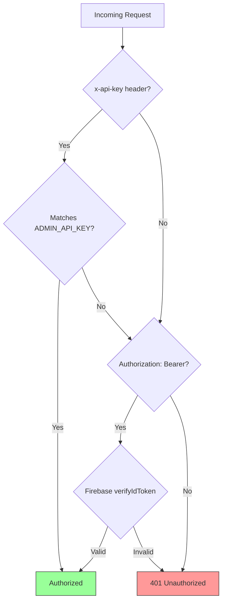
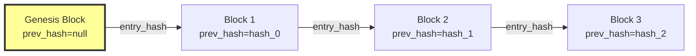
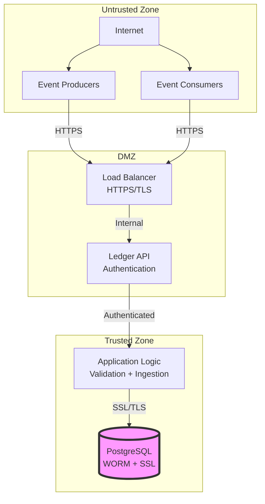

# PROVENIQ Memory (Ledger) - Security Model

**Last Verified Against Commit:** `4146303`  
**Schema Version:** 1.0.0

---

## Executive Summary

PROVENIQ Memory employs a **defense-in-depth security model** with multiple layers of protection. Security guarantees are primarily **machine-enforced** through code, database constraints, and cryptography, not policy-enforced through organizational procedures.

**Security Posture:** High-assurance immutable event store with cryptographic integrity verification

---

## Authentication Mechanisms

### Dual Authentication Strategy

**Source:** `backend/src/auth.ts`



**Authentication Methods:** [SHIPPED]

| Method | Header | Validation | Use Case | Enforcement |
|--------|--------|------------|----------|-------------|
| **Firebase ID Token** | `Authorization: Bearer <token>` | Firebase Admin SDK `verifyIdToken()` | User-initiated requests | Machine-Enforced |
| **Admin API Key** | `x-api-key: <key>` | String comparison with `ADMIN_API_KEY` env var | Service-to-service | Machine-Enforced |

**Authentication Flow:**
1. Check for `x-api-key` header
2. If present and matches `ADMIN_API_KEY`, authorize immediately
3. If not present or mismatch, check for `Authorization: Bearer` header
4. If present, verify Firebase ID token via Firebase Admin SDK
5. If valid, authorize; otherwise return 401 Unauthorized

**Fallback Behavior:** If Firebase is not configured (`FIREBASE_PROJECT_ID` missing), return 503 Service Unavailable [SHIPPED]

---

## Authorization Model

### Endpoint Access Control

**Source:** `backend/src/server.ts`

| Endpoint | Authentication Required | Authorization |
|----------|------------------------|---------------|
| `GET /health` | ❌ No | Public |
| `POST /api/v1/events/canonical` | ✅ Yes | Any authenticated principal |
| `POST /api/v1/events` | ✅ Yes | Any authenticated principal |
| `GET /api/v1/events` | ✅ Yes | Any authenticated principal |
| `GET /api/v1/events/:id` | ✅ Yes | Any authenticated principal |
| `GET /api/v1/assets/:assetId/events` | ✅ Yes | Any authenticated principal |
| `GET /api/v1/anchors/:anchorId/events` | ✅ Yes | Any authenticated principal |
| `GET /api/v1/integrity/verify` | ✅ Yes | Any authenticated principal |
| `GET /api/v1/stats` | ✅ Yes | Any authenticated principal |

**Authorization Characteristics:**
- **No Role-Based Access Control (RBAC):** All authenticated principals have equal access [SHIPPED]
- **No Row-Level Security:** Cannot filter events by ownership [SHIPPED]
- **No Write Permissions:** All authenticated principals can write events [SHIPPED]
- **No Read Permissions:** All authenticated principals can read all events [SHIPPED]

**Rationale:** The Ledger is a system of record, not an access control system. Authorization is the responsibility of producer services.

---

## Threat Model

### Assets to Protect

| Asset | Value | Protection Mechanism |
|-------|-------|---------------------|
| **Event Integrity** | Critical | SHA-256 hash chain + WORM triggers |
| **Event Ordering** | Critical | BIGSERIAL sequence + advisory locks |
| **Event Authenticity** | High | Producer signatures (optional) |
| **Audit Trail** | High | Append-only audit_log with WORM triggers |
| **API Keys** | Critical | Environment variables (never logged) |
| **Database Credentials** | Critical | Environment variables + SSL/TLS |

---

### Threat Scenarios

#### 1. Event Tampering

**Threat:** Attacker modifies existing events to alter historical record

**Attack Vectors:**
- Direct database UPDATE/DELETE
- SQL injection
- Compromised database credentials

**Mitigations:**
| Mitigation | Type | Effectiveness |
|------------|------|---------------|
| WORM triggers on `ledger_entries` | Machine-Enforced | Blocks UPDATE/DELETE at database level |
| WORM triggers on `audit_log` | Machine-Enforced | Blocks audit trail tampering |
| Parameterized queries (pg library) | Machine-Enforced | Prevents SQL injection |
| Hash chain verification | Machine-Enforced | Detects tampering via integrity script |

**Residual Risk:** Database administrator with trigger bypass privileges could tamper with events, but hash chain verification would detect it [SHIPPED]

---

#### 2. Event Replay

**Threat:** Attacker resubmits valid events to create duplicate records

**Attack Vectors:**
- Intercepted API requests
- Compromised producer credentials
- Man-in-the-middle attacks

**Mitigations:**
| Mitigation | Type | Effectiveness |
|------------|------|---------------|
| Unique constraint on `event_id` | Machine-Enforced | Prevents duplicate event IDs |
| Partial unique index on `idempotency_key` | Machine-Enforced | Prevents duplicate client keys |
| HTTPS/TLS transport encryption | Machine-Enforced | Prevents interception |
| Idempotent response (200 OK) | Machine-Enforced | Safe retry behavior |

**Residual Risk:** None - replay attacks are fully mitigated [SHIPPED]

---

#### 3. Hash Chain Fork

**Threat:** Concurrent writes create multiple valid chains (fork)

**Attack Vectors:**
- Race condition in hash calculation
- Concurrent INSERT operations
- Database replication lag

**Mitigations:**
| Mitigation | Type | Effectiveness |
|------------|------|---------------|
| Advisory lock (`pg_advisory_xact_lock`) | Machine-Enforced | Serializes all canonical writes |
| Transaction-scoped lock | Machine-Enforced | Automatic release on commit/rollback |
| Unique constraint on `sequence_number` | Machine-Enforced | Prevents duplicate sequences |

**Residual Risk:** None - forks are impossible with advisory locks [SHIPPED]

---

#### 4. Unauthorized Access

**Threat:** Unauthenticated attacker reads or writes events

**Attack Vectors:**
- Missing authentication
- Stolen API keys
- Compromised Firebase tokens

**Mitigations:**
| Mitigation | Type | Effectiveness |
|------------|------|---------------|
| `requireAuth` middleware on all endpoints | Machine-Enforced | Blocks unauthenticated requests |
| Firebase token verification | Machine-Enforced | Validates token signature and expiry |
| API key comparison | Machine-Enforced | Validates service credentials |
| HTTPS/TLS transport encryption | Machine-Enforced | Prevents credential interception |

**Residual Risk:** Stolen credentials grant full access until revoked [SHIPPED]

---

#### 5. Denial of Service

**Threat:** Attacker overwhelms service with requests

**Attack Vectors:**
- High-volume API requests
- Large payload submissions
- Slow query attacks

**Mitigations:**
| Mitigation | Type | Effectiveness |
|------------|------|---------------|
| Rate limiting | [UNKNOWN] | Not implemented in code |
| Request size limits | [UNKNOWN] | Not implemented in code |
| Query timeout | [UNKNOWN] | Not implemented in code |
| Connection pooling (max 10) | Machine-Enforced | Limits concurrent DB connections |

**Residual Risk:** High - no application-level DoS protection [UNKNOWN]

---

#### 6. Privilege Escalation

**Threat:** Attacker gains administrative access

**Attack Vectors:**
- Stolen `ADMIN_API_KEY`
- Firebase admin account compromise
- Database credential theft

**Mitigations:**
| Mitigation | Type | Effectiveness |
|------------|------|---------------|
| Environment variable isolation | Policy-Enforced | Credentials not in code |
| 64+ character API key requirement (production) | Machine-Enforced | Brute force resistance |
| Firebase token expiry | Machine-Enforced | Time-limited access |
| Database SSL/TLS requirement (production) | Machine-Enforced | Encrypted credentials in transit |

**Residual Risk:** Compromised credentials grant full access until rotated [SHIPPED]

---

## Cryptographic Guarantees

### Hash Chain Integrity

**Algorithm:** SHA-256 (FIPS 180-4)

**Hash Linkage:**
```
entry_hash = SHA256(payload_hash | previous_hash | source | event_type | timestamp)
```

**Source:** `backend/src/hash.ts` + `backend/src/ingest/canonical.ts`



**Cryptographic Properties:**
- **Collision Resistance:** SHA-256 provides 2^128 collision resistance [SHIPPED]
- **Preimage Resistance:** Cannot reverse hash to find input [SHIPPED]
- **Determinism:** Same input always produces same hash [SHIPPED]
- **Avalanche Effect:** Single bit change cascades through chain [SHIPPED]

**Verification:**
```bash
npm run verify-integrity
```

**Exit Codes:**
- `0` = Chain valid (all hashes verified)
- `1` = Integrity violation detected
- `2` = Verification error

---

### Payload Hash Calculation

**Source:** `backend/src/hash.ts`

```typescript
export function hashPayload(payload: unknown): string {
  // Deterministic key ordering
  const canonical = JSON.stringify(payload, Object.keys(payload as object).sort());
  return createHash('sha256').update(canonical).digest('hex');
}
```

**Critical:** Key ordering MUST be deterministic for hash reproducibility [SHIPPED]

---

### Entry Hash Calculation

**Source:** `backend/src/ingest/canonical.ts`

```typescript
function hashEntry(
  payloadHash: string,
  previousHash: string | null,
  sequenceNumber: number,
  eventId: string
): string {
  const material = JSON.stringify({
    previous_hash: previousHash,
    payload_hash: payloadHash,
    sequence_number: sequenceNumber,
    event_id: eventId,
  });
  
  return createHash('sha256').update(material).digest('hex');
}
```

**Note:** Field order in JSON.stringify is deterministic via explicit object construction [SHIPPED]

---

## Data Protection

### Data at Rest

| Data Type | Storage | Encryption | Enforcement |
|-----------|---------|------------|-------------|
| **Events** | PostgreSQL JSONB | Database-level encryption | [UNKNOWN] |
| **Hashes** | PostgreSQL TEXT | Not encrypted (public hashes) | [SHIPPED] |
| **Audit Log** | PostgreSQL JSONB | Database-level encryption | [UNKNOWN] |
| **Environment Variables** | Railway secrets | Platform-managed | [UNKNOWN] |

**Database Encryption:** Depends on PostgreSQL configuration and platform (Railway) [UNKNOWN]

---

### Data in Transit

| Connection | Protocol | Enforcement |
|------------|----------|-------------|
| **Client → API** | HTTPS/TLS 1.2+ | Platform-enforced (Railway) |
| **API → PostgreSQL** | PostgreSQL SSL/TLS | Required in production (`?sslmode=require`) |
| **API → Firebase** | HTTPS/TLS 1.2+ | Firebase SDK default |

**TLS Requirements (Production):** [SHIPPED]
- `DATABASE_URL` must include `?sslmode=require` or `?ssl=true`
- Validated at startup via `backend/src/config/env-validation.ts`
- Application refuses to start if SSL not configured

---

## Secrets Management

### Environment Variables

**Source:** `backend/src/config/env-validation.ts`

| Secret | Storage | Rotation | Exposure Risk |
|--------|---------|----------|---------------|
| `DATABASE_URL` | Railway secrets | Manual | High (full DB access) |
| `ADMIN_API_KEY` | Railway secrets | Manual | High (full API access) |
| `FIREBASE_PROJECT_ID` | Railway secrets | N/A (public) | Low (public identifier) |
| `GOOGLE_APPLICATION_CREDENTIALS` | Railway file upload | Manual | Critical (Firebase admin) |

**Protection Mechanisms:**
- Never logged in application code [SHIPPED]
- Never committed to git (`.gitignore` enforced) [SHIPPED]
- Validated at startup (hard fail if missing) [SHIPPED]
- Minimum length requirements (64+ chars for API key in production) [SHIPPED]

**Rotation Policy:** [UNKNOWN - not specified in code]

---

## Audit and Logging

### Audit Log

**Table:** `audit_log`

**Protected By:** WORM triggers (append-only) [SHIPPED]

**Logged Events:**
- `canonical_event_ingested` - Event written to ledger
- `event_ingested` - Legacy event written
- `event_read` - Single event retrieved
- `integrity_verified` - Integrity check performed

**Audit Entry Structure:**
```typescript
{
  id: string;              // UUID
  action: string;          // Event type
  actor_id: string | null; // Who performed action
  resource_type: string;   // What was accessed
  resource_id: string | null; // Specific resource
  details: Record<string, unknown> | null; // Additional context
  ip_address: string | null; // Client IP
  created_at: string;      // Timestamp
}
```

**Audit Trail Guarantees:**
- Cannot be modified (WORM trigger) [SHIPPED]
- Cannot be deleted (WORM trigger) [SHIPPED]
- Chronologically ordered (created_at) [SHIPPED]

---

### Structured Logging

**Format:** JSON (production) or text (development)

**Configuration:** `LOG_FORMAT` environment variable [SHIPPED]

**Log Fields (Canonical Ingestion):**
```json
{
  "level": "info",
  "msg": "ledger_canonical_ingest_success",
  "client_id": "service-name",
  "event_id": "uuid",
  "sequence_number": 12345,
  "previous_hash": "sha256-hex",
  "attempted_hash": "sha256-hex",
  "at": "2024-12-29T12:00:00Z"
}
```

**Critical:** No secrets logged (payload, credentials, tokens) [SHIPPED]

---

## Security Boundaries

### Trust Zones



**Boundary Enforcement:**
- **Internet → DMZ:** HTTPS/TLS (platform-enforced)
- **DMZ → Trusted:** Authentication (machine-enforced)
- **Trusted → Database:** SSL/TLS + credentials (machine-enforced)

---

## Compliance Considerations

### Data Retention

**Policy:** Infinite retention (immutable by design) [SHIPPED]

**Implications:**
- Cannot delete events (GDPR "right to be forgotten" conflict)
- Cannot modify events (data correction impossible)
- Audit trail is permanent

**Mitigation:** Do NOT store PII in event payloads [POLICY-ENFORCED]

---

### Regulatory Alignment

| Requirement | Implementation | Status |
|-------------|----------------|--------|
| **SOC 2 - Logical Access** | Dual authentication | [SHIPPED] |
| **SOC 2 - Change Management** | Immutable events | [SHIPPED] |
| **SOC 2 - System Monitoring** | Audit log | [SHIPPED] |
| **GDPR - Data Minimization** | No PII in payloads | [POLICY-ENFORCED] |
| **GDPR - Right to Erasure** | Not supported | [IMPOSSIBLE] |
| **HIPAA - Audit Controls** | Append-only audit log | [SHIPPED] |
| **HIPAA - Integrity Controls** | Hash chain verification | [SHIPPED] |

---

## Security Testing

### Verification Procedures

**1. WORM Trigger Test:**
```sql
-- Should fail with integrity_constraint_violation
UPDATE ledger_entries SET payload = '{}' WHERE id = '<uuid>';
DELETE FROM ledger_entries WHERE id = '<uuid>';
```

**2. Replay Protection Test:**
```bash
# Submit same event twice - second should return 200 OK with idempotent=true
curl -X POST /api/v1/events/canonical -d @event.json
curl -X POST /api/v1/events/canonical -d @event.json
```

**3. Hash Chain Integrity Test:**
```bash
npm run verify-integrity
# Should exit 0 (valid)
```

**4. Authentication Test:**
```bash
# Should return 401 Unauthorized
curl -X GET /api/v1/events
```

---

## Known Limitations

### Security Gaps

| Gap | Impact | Mitigation | Status |
|-----|--------|------------|--------|
| **No Rate Limiting** | DoS vulnerability | Add rate limiting middleware | [UNKNOWN] |
| **No Request Size Limits** | Memory exhaustion | Add payload size limits | [UNKNOWN] |
| **No Query Timeouts** | Slow query DoS | Add query timeout | [UNKNOWN] |
| **No IP Allowlisting** | Broad attack surface | Add IP filtering | [UNKNOWN] |
| **No RBAC** | All authenticated users equal | Add role-based access | [UNKNOWN] |

### Impossibilities (By Design)

1. **Cannot delete events** - WORM enforcement prevents deletion
2. **Cannot modify events** - WORM enforcement prevents updates
3. **Cannot support GDPR erasure** - Immutability conflicts with right to be forgotten
4. **Cannot revoke events** - No revocation mechanism (events are facts)
5. **Cannot filter by ownership** - No row-level security

---

**Last Verified Against Commit:** `4146303`  
**Schema Version:** 1.0.0
